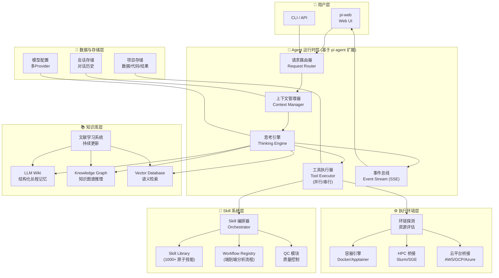
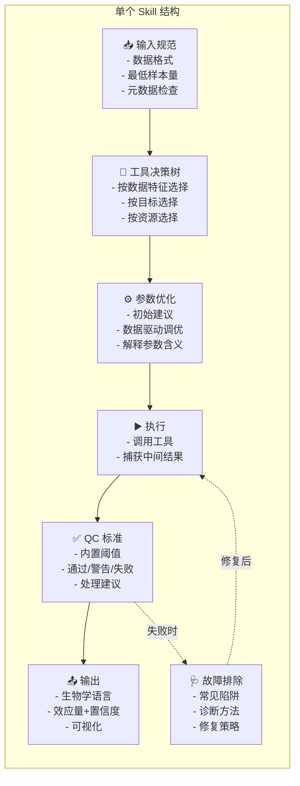
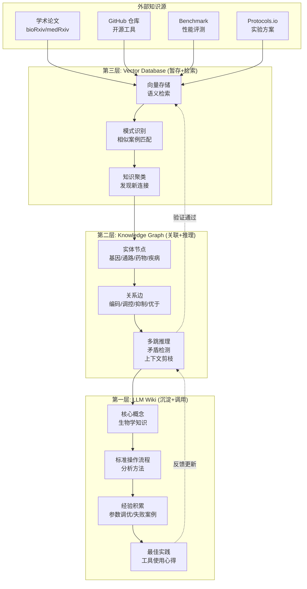
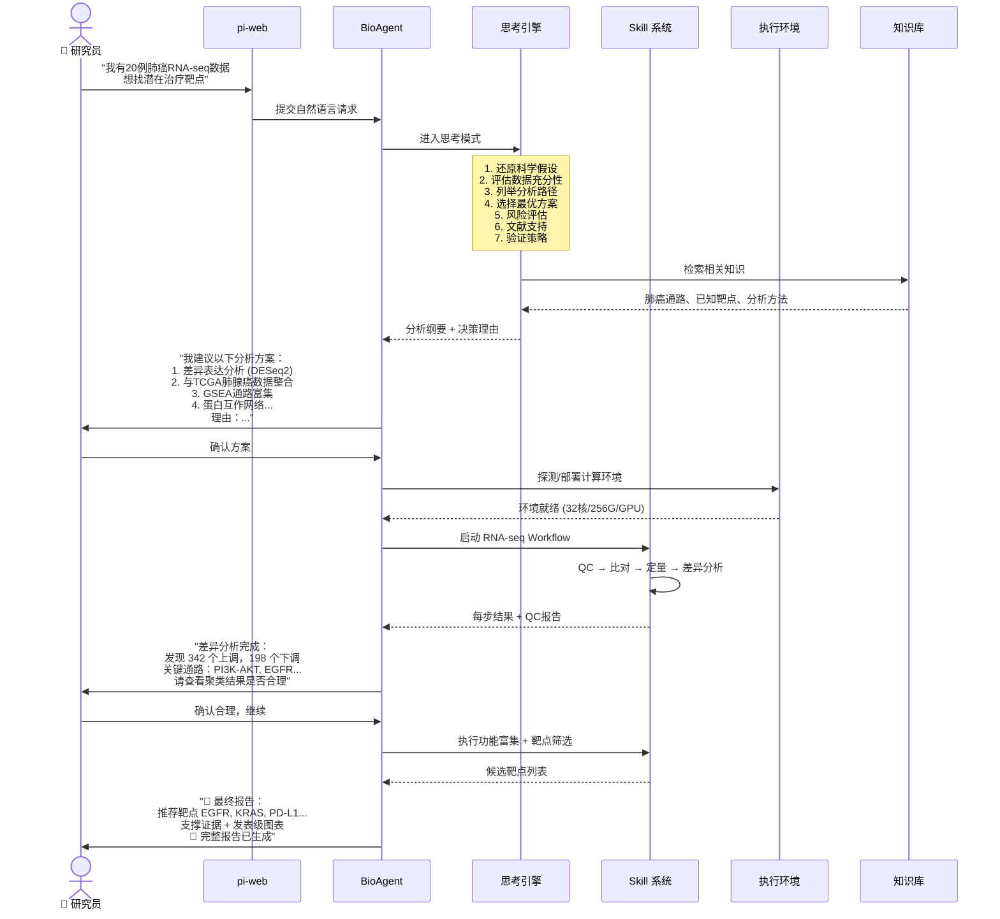
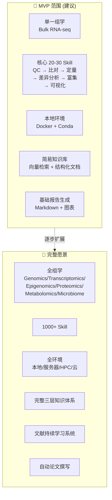

# BioAgent 架构概览图

## 图 1：系统总览架构

```mermaid
graph TB
    subgraph 用户层["👤 用户层"]
        UI["pi-web<br/>Web UI"]
        CLI["CLI / API"]
    end

    subgraph Agent层["🧠 Agent 运行时层 (基于 pi agent 扩展)"]
        Router["请求路由器<br/>Request Router"]
        ContextMgr["上下文管理器<br/>Context Manager"]
        ThinkEngine["思考引擎<br/>Thinking Engine"]
        ToolExecutor["工具执行器<br/>Tool Executor<br/>(并行/串行)"]
        EventBus["事件总线<br/>Event Stream (SSE)"]
    end

    subgraph Skill层["🔧 Skill 系统层"]
        SkillLib["Skill Library<br/>(1000+ 原子技能)"]
        SkillOrch["Skill 编排器<br/>Orchestrator"]
        WorkflowReg["Workflow Registry<br/>(端到端分析流程)"]
        QCModule["QC 模块<br/>质量控制"]
    end

    subgraph 知识层["📚 知识库层"]
        Wiki["LLM Wiki<br/>结构化长程记忆"]
        KG["Knowledge Graph<br/>知识图谱推理"]
        VDB["Vector Database<br/>语义检索"]
        LitLearn["文献学习系统<br/>持续更新"]
    end

    subgraph 执行层["⚙️ 执行环境层"]
        EnvDetect["环境探测<br/>资源评估"]
        ContainerEngine["容器引擎<br/>Docker/Apptainer"]
        HPCBridge["HPC 桥接<br/>Slurm/SGE"]
        CloudBridge["云平台桥接<br/>AWS/GCP/Azure"]
    end

    subgraph 数据层["💾 数据与存储层"]
        ProjectStore["项目存储<br/>数据/代码/结果"]
        SessionStore["会话存储<br/>对话历史"]
        ModelConfig["模型配置<br/>多Provider"]
    end

    UI --> Router
    CLI --> Router
    Router --> ContextMgr
    ContextMgr --> ThinkEngine
    ThinkEngine --> ToolExecutor
    ThinkEngine --> EventBus
    EventBus --> UI

    ToolExecutor --> SkillOrch
    SkillOrch --> SkillLib
    SkillOrch --> WorkflowReg
    SkillOrch --> QCModule

    ThinkEngine --> Wiki
    ThinkEngine --> KG
    ThinkEngine --> VDB
    LitLearn --> Wiki
    LitLearn --> KG
    LitLearn --> VDB

    ToolExecutor --> EnvDetect
    EnvDetect --> ContainerEngine
    EnvDetect --> HPCBridge
    EnvDetect --> CloudBridge

    ProjectStore --- ToolExecutor
    SessionStore --- ContextMgr
    ModelConfig --- ThinkEngine
```

## 图 2：Skill 内部结构

```mermaid
graph LR
    subgraph Skill["单个 Skill 结构"]
        direction TB
        Input["📥 输入规范<br/>- 数据格式<br/>- 最低样本量<br/>- 元数据检查"]
        Decision["🎯 工具决策树<br/>- 按数据特征选择<br/>- 按目标选择<br/>- 按资源选择"]
        Params["⚙️ 参数优化<br/>- 初始建议<br/>- 数据驱动调优<br/>- 解释参数含义"]
        Execute["▶️ 执行<br/>- 调用工具<br/>- 捕获中间结果"]
        QC["✅ QC 标准<br/>- 内置阈值<br/>- 通过/警告/失败<br/>- 处理建议"]
        Output["📤 输出<br/>- 生物学语言<br/>- 效应量+置信度<br/>- 可视化"]
        Troubleshoot["🩺 故障排除<br/>- 常见陷阱<br/>- 诊断方法<br/>- 修复策略"]
        
        Input --> Decision
        Decision --> Params
        Params --> Execute
        Execute --> QC
        QC --> Output
        QC -.->|"失败时"| Troubleshoot
        Troubleshoot -.->|"修复后"| Execute
    end
```

## 图 3：三层知识体系协同

```mermaid
graph TB
    subgraph 外部信息["外部知识源"]
        Papers["学术论文<br/>bioRxiv/medRxiv"]
        GitHub["GitHub 仓库<br/>开源工具"]
        Benchmarks["Benchmark<br/>性能评测"]
        Protocols["Protocols.io<br/>实验方案"]
    end

    subgraph Layer3["第三层: Vector Database (暂存+检索)"]
        VStore["向量存储<br/>语义检索"]
        PatternMatch["模式识别<br/>相似案例匹配"]
        Cluster["知识聚类<br/>发现新连接"]
    end

    subgraph Layer2["第二层: Knowledge Graph (关联+推理)"]
        Entities["实体节点<br/>基因/通路/药物/疾病"]
        Relations["关系边<br/>编码/调控/抑制/优于"]
        Reasoning["多跳推理<br/>矛盾检测<br/>上下文剪枝"]
    end

    subgraph Layer1["第一层: LLM Wiki (沉淀+调用)"]
        Concepts["核心概念<br/>生物学知识"]
        SOPs["标准操作流程<br/>分析方法"]
        Experience["经验积累<br/>参数调优/失败案例"]
        BestPractice["最佳实践<br/>工具使用心得"]
    end

    Papers --> VStore
    GitHub --> VStore
    Benchmarks --> VStore
    Protocols --> VStore

    VStore --> PatternMatch
    PatternMatch --> Cluster
    Cluster --> Entities
    Entities --> Relations
    Relations --> Reasoning
    Reasoning --> Concepts

    Concepts --> SOPs
    SOPs --> Experience
    Experience --> BestPractice

    BestPractice -.->|"反馈更新"| Reasoning
    Reasoning -.->|"验证通过"| VStore
```

## 图 4：用户交互流程

```mermaid
sequenceDiagram
    actor User as 👤 研究员
    participant Web as pi-web
    participant Agent as BioAgent
    participant Think as 思考引擎
    participant Skill as Skill 系统
    participant Env as 执行环境
    participant KB as 知识库

    User->>Web: "我有20例肺癌RNA-seq数据<br/>想找潜在治疗靶点"
    Web->>Agent: 提交自然语言请求
    
    Agent->>Think: 进入思考模式
    
    Note over Think: 1. 还原科学假设<br/>2. 评估数据充分性<br/>3. 列举分析路径<br/>4. 选择最优方案<br/>5. 风险评估<br/>6. 文献支持<br/>7. 验证策略

    Think->>KB: 检索相关知识
    KB-->>Think: 肺癌通路、已知靶点、分析方法

    Think-->>Agent: 分析纲要 + 决策理由
    
    Agent->>User: "我建议以下分析方案：<br/>1. 差异表达分析 (DESeq2)<br/>2. 与TCGA肺腺癌数据整合<br/>3. GSEA通路富集<br/>4. 蛋白互作网络...<br/>理由：..."

    User->>Agent: 确认方案
    
    Agent->>Env: 探测/部署计算环境
    Env-->>Agent: 环境就绪 (32核/256G/GPU)

    Agent->>Skill: 启动 RNA-seq Workflow
    Skill->>Skill: QC → 比对 → 定量 → 差异分析
    Skill-->>Agent: 每步结果 + QC报告

    Agent->>User: "差异分析完成：<br/>发现 342 个上调，198 个下调<br/>关键通路：PI3K-AKT, EGFR...<br/>请查看聚类结果是否合理"

    User->>Agent: 确认合理，继续
    
    Agent->>Skill: 执行功能富集 + 靶点筛选
    Skill-->>Agent: 候选靶点列表

    Agent->>User: "🎯 最终报告：<br/>推荐靶点 EGFR, KRAS, PD-L1...<br/>支撑证据 + 发表级图表<br/>📄 完整报告已生成"
```

## 图 5：MVP vs 愿景范围

```mermaid
graph TB
    subgraph Vision["🌟 完整愿景"]
        AllOmics["全组学<br/>Genomics/Transcriptomics/<br/>Epigenomics/Proteomics/<br/>Metabolomics/Microbiome"]
        AllSkills["1000+ Skill"]
        AllEnv["全环境<br/>本地/服务器/HPC/云"]
        FullKB["完整三层知识体系"]
        FullLearn["文献持续学习系统"]
        FullReport["自动论文撰写"]
    end

    subgraph MVP["🎯 MVP 范围 (建议)"]
        OneOmics["单一组学<br/>Bulk RNA-seq"]
        CoreSkills["核心 20-30 Skill<br/>QC → 比对 → 定量<br/>→ 差异分析 → 富集<br/>→ 可视化"]
        LocalEnv["本地环境<br/>Docker + Conda"]
        SimpleKB["简易知识库<br/>向量检索 + 结构化文档"]
        BasicReport["基础报告生成<br/>Markdown + 图表"]
    end

    MVP -.->|"逐步扩展"| Vision
```

---

> 这些图表将在设计讨论中持续更新。接下来进入需求澄清环节。
