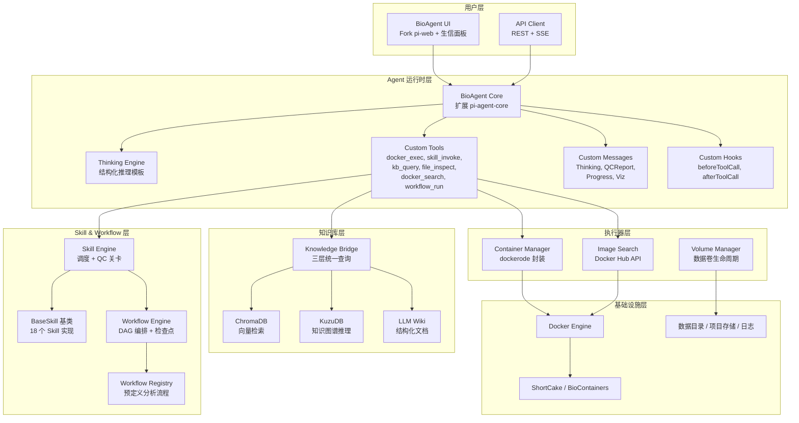

# BioAgent MVP 详细设计文档

> 版本: 1.0 | 日期: 2026-05-31 | 状态: 待审核
>
> 基于 [BioAgent 总体需求说明书](../BioAgent%20总体需求说明书.docx) Vision Draft 的 MVP 工程实现设计

---

## 目录

1. [项目概述与目标](#1-项目概述与目标)
2. [核心执行范式](#2-核心执行范式)
3. [系统总览架构](#3-系统总览架构)
4. [项目结构与技术栈](#4-项目结构与技术栈)
5. [Agent 运行时层详细设计](#5-agent-运行时层详细设计)
6. [Docker 执行器详细设计](#6-docker-执行器详细设计)
7. [三层知识体系详细设计](#7-三层知识体系详细设计)
8. [Skill 系统详细设计](#8-skill-系统详细设计)
9. [Workflow 编排引擎详细设计](#9-workflow-编排引擎详细设计)
10. [前端 UI 详细设计](#10-前端-ui-详细设计)
11. [API 路由设计](#11-api-路由设计)
12. [数据模型与存储](#12-数据模型与存储)
13. [配置管理](#13-配置管理)
14. [错误处理与日志](#14-错误处理与日志)
15. [测试策略](#15-测试策略)
16. [开发路线图](#16-开发路线图)
17. [GitHub 仓库配置](#17-github-仓库配置)

---

## 1. 项目概述与目标

### 1.1 项目定义

BioAgent 是 AI 驱动的生物信息学 Agent 系统。它的核心能力是：用户用自然语言描述生物学问题，BioAgent 自动选择、部署和调度 Docker 容器中的生信工具，完成端到端数据分析。

### 1.2 MVP 范围

| 维度 | 范围 |
|------|------|
| 组学类型 | **仅单细胞 RNA-seq (scRNA-seq)** |
| 执行模式 | **全自动执行**（关键节点暂停确认） |
| 前端 | **Fork pi-web** + 生信面板定制 |
| 知识体系 | **完整三层**：Vector DB + Knowledge Graph + LLM Wiki |
| 环境部署 | **Docker-in-Docker**，基于现成镜像（ShortCake 为主力） |
| 架构模式 | **结构化 Skill 管线**（方案 B） |
| AI 模型 | Claude Sonnet 4.6（通过 pi-ai 多 provider 抽象） |

### 1.3 MVP 不做什么

- ❌ 不预装任何生信工具到 Agent 本体
- ❌ 不实现文献持续学习系统（知识种子手工注入）
- ❌ 不支持 HPC/云平台（仅本地 Docker）
- ❌ 不支持除 scRNA-seq 外的其他组学
- ❌ 不实现自动论文撰写
- ❌ 不实现 HPC Slurm/SGE 桥接

---

## 2. 核心执行范式

### 2.1 BioAgent 不内置分析能力

BioAgent 本体只包含 Node.js + TypeScript 逻辑。**所有生信工具都在 Docker 容器中运行**。

```
┌─────────────────────────────────────────────────────────────────┐
│                        BioAgent 本体                              │
│  (Node.js + pi-agent-core)                                       │
│                                                                   │
│  能力:                                                           │
│  • 理解科学问题 → 设计分析方案                                      │
│  • 搜索/选择/拉取 Docker 镜像                                      │
│  • 启动/管理容器生命周期                                           │
│  • 向容器发送分析命令                                              │
│  • 监控执行 + 收集输出 + 解读结果                                  │
│  • 生成报告                                                       │
│                                                                   │
│  不包含: 任何 Python/R/生信工具/分析库                              │
└──────────────────────────┬──────────────────────────────────────┘
                           │ docker exec / docker run
                           ▼
┌─────────────────────────────────────────────────────────────────┐
│                     Docker 容器 (ShortCake 等)                     │
│                                                                   │
│  包含: Python 3.10+ / R 4.x / Scanpy / Seurat / Monocle3 /       │
│        scVelo / CellChat / SCENIC / CellTypist / scrublet /      │
│        Harmony / clusterProfiler / GSEApy / matplotlib /         │
│        ggplot2 / ... (100+ 工具)                                  │
└─────────────────────────────────────────────────────────────────┘
```

### 2.2 对所有组学统一的六步执行模式

```
用户: "我有 XX 数据，想分析 YY 问题"
            │
            ▼
Step 1 ─ 组学识别
  Agent 判断: 这是什么组学？数据结构是什么？
  工具: file_inspect → 解析文件格式 (h5ad/h5/mtx/fastq/rds/...)
  
            │
            ▼
Step 2 ─ 镜像选择
  Agent 决策: 该组学用什么 Docker 镜像？
  优先: Skill 中已记录的已知镜像
  否则: docker_search → Docker Hub 搜索 → 评估 → 选择
  MVP 默认: scRNA-seq → rnakato/shortcake_full:latest
  
            │
            ▼
Step 3 ─ 镜像就绪
  Agent 执行: docker pull {image} (如本地不存在)
  验证: docker run --rm {image} which python → 确认工具可用
  
            │
            ▼
Step 4 ─ 容器启动
  Agent 执行: docker run -d -v {data}:/data --name {container} {image} tail -f /dev/null
  作用: 保持容器运行，随时 docker exec 命令
  挂载: 用户数据目录 (ro) + 输出目录 (rw)
  
            │
            ▼
Step 5 ─ 分析执行
  Agent 循环: docker exec {container} python -c '...'
  每个命令 = 一个 Skill 的一个步骤
  监控: 超时 / 错误退出码 / stderr 异常
  QC: 每个 Skill 完成后运行 QC 关卡
  检查点: 关键节点后保存中间状态
  
            │
            ▼
Step 6 ─ 结果与清理
  Agent 执行: docker stop {container} && docker rm {container}
  结果读取: 从挂载的输出目录读取结果文件
  报告生成: Markdown + HTML 报告
  知识归档: 分析经验写入知识库
```

### 2.3 镜像选择决策表

Agent 面对不同组学时的默认镜像策略：

| 组学类型 | 首选镜像 | 备选镜像 | 适用条件 |
|---------|---------|---------|---------|
| scRNA-seq（完整流程） | `rnakato/shortcake_full:latest` | — | 默认，覆盖全流程 |
| scRNA-seq（仅 Seurat 生态） | `bontix77/sc_rna:latest` | — | 仅需 R/Seurat 时 |
| scRNA-seq（单工具） | `quay.io/biocontainers/scanpy` | `quay.io/biocontainers/seurat` | 特定单步操作 |
| Bulk RNA-seq（比对） | `jibinjv/aligner:latest` | `quay.io/biocontainers/star` | STAR/HISAT2/BWA |
| scATAC-seq | `rnakato/shortcake_full:latest` | — | Signac, ArchR |
| WGS | `broadinstitute/gatk:latest` | `quay.io/biocontainers/gatk4` | GATK 管线 |
| 未知工具/新需求 | `docker_search` 动态搜索 | — | Docker Hub API |

---

## 3. 系统总览架构

### 3.1 六层架构



### 3.2 数据流总览

```
用户输入 (自然语言 + 数据文件)
     │
     ▼
[file_inspect] ─── 数据格式识别 + 结构摘要
     │
     ▼
[kb_query] ─── 三层知识库查询 (相关方法、相似案例、已知 marker)
     │
     ▼
[Thinking Engine] ─── 结构化推理 → 分析方案
     │
     ▼
[用户确认] ─── (可选，视配置而定)
     │
     ▼
[docker_search / Image Selector] ─── 选择/拉取 Docker 镜像
     │
     ▼
[docker_exec] ─── 启动 ShortCake 容器
     │
     ▼
[workflow_run] ─── 启动 scrna-seq-standard Workflow
     │
     ▼
[Skill 循环] ─── 13-18 个 Skill 逐个在容器内执行
     │             每步: docker_exec → 解析输出 → QC → 检查点
     ▼
[report-generator] ─── 从中间结果渲染 HTML 报告
     │
     ▼
用户获得: 分析结果 + 可视化 + 报告 + 知识归档
```

---

## 4. 项目结构与技术栈

### 4.1 Monorepo 完整目录树

```
BioAgent/
├── .github/
│   ├── workflows/
│   │   ├── ci.yml                    # CI: typecheck + lint + test
│   │   └── docker-build.yml          # 构建 BioAgent 自身 Docker 镜像
│   └── ISSUE_TEMPLATE/
│       └── feature_request.md
│
├── packages/
│   │
│   ├── agent-core/                   # BioAgent 核心 (扩展 pi agent)
│   │   ├── src/
│   │   │   ├── bio-agent.ts          # BioAgent 主类
│   │   │   ├── bio-agent.config.ts   # Agent 配置类型 + 默认值
│   │   │   ├── thinking-engine.ts    # 结构化思考引擎
│   │   │   ├── thinking-template.ts  # 思考模板定义
│   │   │   ├── tools/
│   │   │   │   ├── index.ts          # 所有工具导出
│   │   │   │   ├── docker-exec.tool.ts      # 容器命令执行
│   │   │   │   ├── docker-search.tool.ts    # Docker Hub 搜索
│   │   │   │   ├── docker-pull.tool.ts      # 镜像拉取
│   │   │   │   ├── docker-inspect.tool.ts   # 镜像内容检查
│   │   │   │   ├── docker-verify.tool.ts    # 工具可用性验证
│   │   │   │   ├── skill-invoke.tool.ts     # Skill 调用
│   │   │   │   ├── kb-query.tool.ts         # 知识库查询
│   │   │   │   ├── file-inspect.tool.ts     # 文件格式探测
│   │   │   │   └── workflow-run.tool.ts     # Workflow 启动
│   │   │   ├── hooks/
│   │   │   │   ├── validation.hook.ts       # beforeToolCall 参数校验
│   │   │   │   ├── qc.hook.ts               # afterToolCall QC 判定
│   │   │   │   └── thinking.hook.ts         # 思考模板注入
│   │   │   ├── messages/
│   │   │   │   ├── thinking.message.ts      # 思考过程消息
│   │   │   │   ├── qc-report.message.ts     # QC 报告消息
│   │   │   │   ├── progress.message.ts      # 任务进度消息
│   │   │   │   └── viz.message.ts           # 可视化消息
│   │   │   ├── events/
│   │   │   │   └── event-types.ts           # SSE 事件类型枚举
│   │   │   ├── session/
│   │   │   │   └── session-manager.ts       # 会话管理 (JSONL 存储)
│   │   │   └── types.ts                     # 核心类型定义
│   │   ├── package.json
│   │   └── tsconfig.json
│   │
│   ├── executor/                     # Docker 执行环境
│   │   ├── src/
│   │   │   ├── container-manager.ts  # 容器生命周期管理
│   │   │   ├── container-manager.types.ts
│   │   │   ├── image-manager.ts      # 镜像缓存 + 拉取策略
│   │   │   ├── image-search.ts       # Docker Hub API 搜索
│   │   │   ├── image-search.types.ts
│   │   │   ├── volume-manager.ts     # 数据卷挂载管理
│   │   │   ├── docker-executor.ts    # docker_exec 统一入口
│   │   │   ├── resource-probe.ts     # 宿主机资源探测 (CPU/RAM/GPU/Disk)
│   │   │   ├── resource-probe.types.ts
│   │   │   └── index.ts
│   │   ├── package.json
│   │   └── tsconfig.json
│   │
│   ├── skills/                       # Skill 库
│   │   ├── src/
│   │   │   ├── base-skill.ts         # Skill 抽象基类
│   │   │   ├── base-skill.types.ts   # SkillSpec, SkillResult, QCReport 类型
│   │   │   ├── skill-registry.ts     # Skill 注册与发现
│   │   │   ├── skill-loader.ts       # 从文件系统加载 Skill
│   │   │   ├── skill-executor.ts     # Skill 执行器 (输入校验→决策→执行→QC)
│   │   │   │
│   │   │   ├── io/
│   │   │   │   └── data-import.skill.ts
│   │   │   ├── qc/
│   │   │   │   ├── scrna-qc.skill.ts
│   │   │   │   └── doublet-detection.skill.ts
│   │   │   ├── preprocess/
│   │   │   │   ├── scrna-normalize.skill.ts
│   │   │   │   ├── hvg-selection.skill.ts
│   │   │   │   ├── scrna-pca.skill.ts
│   │   │   │   └── batch-correction.skill.ts
│   │   │   ├── embed/
│   │   │   │   └── umap-tsne.skill.ts
│   │   │   ├── cluster/
│   │   │   │   └── clustering.skill.ts
│   │   │   ├── annotate/
│   │   │   │   └── cell-annotation.skill.ts
│   │   │   ├── analysis/
│   │   │   │   ├── marker-detection.skill.ts
│   │   │   │   ├── diff-expression.skill.ts
│   │   │   │   ├── functional-enrichment.skill.ts
│   │   │   │   ├── trajectory.skill.ts
│   │   │   │   └── cell-communication.skill.ts
│   │   │   ├── network/
│   │   │   │   └── grn.skill.ts
│   │   │   └── report/
│   │   │       └── report-generator.skill.ts
│   │   ├── package.json
│   │   └── tsconfig.json
│   │
│   ├── knowledge/                    # 三层知识体系
│   │   ├── src/
│   │   │   ├── bridge.ts             # KnowledgeBridge 统一查询
│   │   │   ├── bridge.types.ts
│   │   │   │
│   │   │   ├── vector-db/
│   │   │   │   ├── chroma-client.ts  # ChromaDB 客户端封装
│   │   │   │   ├── collections.ts    # Collection 定义
│   │   │   │   └── embedder.ts       # Embedding 生成
│   │   │   │
│   │   │   ├── graph-db/
│   │   │   │   ├── kuzu-client.ts    # KuzuDB 嵌入式客户端
│   │   │   │   ├── schema.ts         # 图 Schema 定义
│   │   │   │   ├── queries.ts        # Cypher 查询模板
│   │   │   │   └── seed-data.ts      # 种子数据加载
│   │   │   │
│   │   │   ├── wiki/
│   │   │   │   ├── wiki-loader.ts    # Wiki 文档加载器
│   │   │   │   ├── wiki-index.ts     # Wiki 索引 (title → file)
│   │   │   │   └── wiki-parser.ts    # Markdown + YAML frontmatter 解析
│   │   │   │
│   │   │   ├── seed/
│   │   │   │   ├── seed-runner.ts    # 种子数据注入编排
│   │   │   │   ├── scrub-seed.ts     # scRNA-seq 知识种子
│   │   │   │   ├── biology-seed.ts   # 基础生物学概念种子
│   │   │   │   └── tool-seed.ts      # 工具使用经验种子
│   │   │   │
│   │   │   └── index.ts
│   │   │
│   │   ├── data/
│   │   │   ├── wiki/                 # LLM Wiki 文档
│   │   │   │   ├── biology/
│   │   │   │   │   ├── molecular-biology.md
│   │   │   │   │   ├── cell-biology.md
│   │   │   │   │   ├── cancer-biology.md
│   │   │   │   │   └── immunology.md
│   │   │   │   ├── omics/
│   │   │   │   │   └── scrna-seq/
│   │   │   │   │       ├── overview.md
│   │   │   │   │       ├── qc-best-practices.md
│   │   │   │   │       ├── normalization-methods.md
│   │   │   │   │       ├── batch-correction.md
│   │   │   │   │       ├── clustering-guide.md
│   │   │   │   │       ├── cell-annotation.md
│   │   │   │   │       ├── trajectory-analysis.md
│   │   │   │   │       └── cell-communication.md
│   │   │   │   ├── tools/
│   │   │   │   │   ├── scanpy.md
│   │   │   │   │   ├── seurat.md
│   │   │   │   │   ├── monocle3.md
│   │   │   │   │   └── cellchat.md
│   │   │   │   ├── sop/
│   │   │   │   │   └── scrna-standard-pipeline.md
│   │   │   │   └── failures/
│   │   │   │       ├── batch-effect-misdiagnosis.md
│   │   │   │       └── over-correction-warning.md
│   │   │   └── graph/                # 图谱种子数据
│   │   │       ├── genes.csv
│   │   │       ├── pathways.csv
│   │   │       ├── cell_markers.csv
│   │   │       └── relations.csv
│   │   ├── package.json
│   │   └── tsconfig.json
│   │
│   ├── workflow/                     # Workflow 编排引擎
│   │   ├── src/
│   │   │   ├── engine.ts             # DAG 执行引擎
│   │   │   ├── engine.types.ts
│   │   │   ├── scheduler.ts          # 拓扑排序 + 并行度控制
│   │   │   ├── checkpoint.ts         # 检查点管理 (保存/恢复)
│   │   │   ├── checkpoint.types.ts
│   │   │   ├── registry.ts           # Workflow 注册与发现
│   │   │   ├── condition.ts          # 条件分支评估
│   │   │   ├── error-policy.ts       # 错误处理 + 降级 + 重试
│   │   │   │
│   │   │   ├── workflows/
│   │   │   │   └── scrna-seq.workflow.ts  # scRNA-seq 标准流程定义
│   │   │   │
│   │   │   └── index.ts
│   │   ├── package.json
│   │   └── tsconfig.json
│   │
│   └── ui/                           # Fork pi-web + 生信定制
│       ├── app/
│       │   ├── layout.tsx
│       │   ├── page.tsx              # 主页
│       │   ├── api/
│       │   │   ├── agent/
│       │   │   │   ├── route.ts      # POST: 发送消息, GET: SSE 流
│       │   │   │   └── sessions/
│       │   │   │       └── route.ts  # 会话列表
│       │   │   ├── workflow/
│       │   │   │   ├── route.ts      # POST: 启动 Workflow
│       │   │   │   └── [id]/
│       │   │   │       └── route.ts  # GET: Workflow 状态
│       │   │   ├── files/
│       │   │   │   ├── route.ts      # POST: 上传文件
│       │   │   │   └── [path]/
│       │   │   │       └── route.ts  # GET: 文件内容/探测
│       │   │   ├── knowledge/
│       │   │   │   └── route.ts      # GET: 知识库查询
│       │   │   ├── viz/
│       │   │   │   └── [type]/
│       │   │   │       └── route.ts  # GET: 可视化数据
│       │   │   └── resources/
│       │   │       └── route.ts      # GET: 宿主机资源状态
│       │   └── projects/
│       │       └── [id]/
│       │           └── page.tsx      # 项目详情页
│       │
│       ├── components/
│       │   ├── bioagent/
│       │   │   ├── ProgressTracker.tsx
│       │   │   ├── ProgressNode.tsx
│       │   │   ├── QCReportCard.tsx
│       │   │   ├── QCReportList.tsx
│       │   │   ├── VizPanel.tsx
│       │   │   ├── VizTabs.tsx
│       │   │   ├── FileBrowser.tsx
│       │   │   ├── FileInspector.tsx
│       │   │   ├── KnowledgeRef.tsx
│       │   │   ├── ThinkingPanel.tsx
│       │   │   ├── WorkflowSelector.tsx
│       │   │   └── ResourceMonitor.tsx
│       │   └── ui/                   # shadcn/ui 组件
│       │
│       ├── lib/
│       │   ├── bioagent-client.ts    # BioAgent API 客户端
│       │   ├── sse-client.ts         # SSE 事件流客户端
│       │   └── utils.ts
│       │
│       ├── hooks/
│       │   ├── useSSE.ts
│       │   ├── useWorkflow.ts
│       │   └── useBioAgent.ts
│       │
│       ├── package.json
│       ├── tailwind.config.ts
│       └── tsconfig.json
│
├── docker/
│   ├── docker-compose.yml            # 开发环境编排
│   │   # - bioagent (自建)
│   │   # - chromadb (向量数据库)
│   │   # - ShortCake 按需启动
│   └── Dockerfile                    # BioAgent 自身镜像
│
├── data/                             # 运行时数据 (gitignore)
│   ├── projects/                     # 项目数据
│   │   └── {project_id}/
│   │       ├── raw/                  # 用户上传的原始数据
│   │       ├── intermediate/         # 中间分析结果
│   │       ├── output/               # 最终输出
│   │       └── checkpoints/          # Workflow 检查点
│   │           └── {workflow_name}.json
│   ├── sessions/                     # Agent 会话 (JSONL)
│   │   └── {encoded_workdir}/
│   │       └── {timestamp}_{uuid}.jsonl
│   ├── chroma/                       # ChromaDB 持久化目录
│   ├── kuzu/                         # KuzuDB 持久化目录
│   └── logs/                         # 运行日志
│       ├── agent.log
│       ├── executor.log
│       └── workflow.log
│
├── docs/
│   ├── architecture-overview.md      # 架构概览图
│   ├── design/
│   │   └── bioagent-mvp-design.md    # 本文档
│   ├── api/
│   │   └── openapi.yaml              # API 文档
│   └── contributing/
│       └── skill-development.md      # Skill 开发指南
│
├── scripts/
│   ├── dev.sh                        # 开发启动脚本
│   ├── seed-knowledge.ts             # 知识库种子注入脚本
│   └── verify-setup.ts               # 环境验证脚本
│
├── package.json                      # Workspace root
├── pnpm-workspace.yaml
├── tsconfig.base.json
├── .gitignore
├── .env.example
├── CLAUDE.md
└── README.md
```

### 4.2 技术栈明细

| 层级 | 技术选型 | 版本 | 理由 |
|------|---------|------|------|
| **语言** | TypeScript | 5.x | pi agent 生态一致，全栈类型安全 |
| **运行时** | Node.js | 22 LTS | 最新 LTS，ESM 原生支持 |
| **Agent 框架** | `@earendil-works/pi-agent-core` | latest | 需求文档指定 |
| **LLM Provider** | `@earendil-works/pi-ai` | latest | 多 provider 抽象 (Claude/OpenAI/...) |
| **默认模型** | Claude Sonnet 4.6 | — | 生物推理能力强 |
| **包管理** | pnpm | 9.x | monorepo workspace 最佳支持 |
| **前端框架** | Next.js | 15.x (App Router) | pi-web 技术栈 |
| **前端样式** | TailwindCSS | 4.x | pi-web 技术栈 |
| **UI 组件** | shadcn/ui | latest | React 组件库 |
| **Docker SDK** | dockerode | 4.x | Node.js Docker API 封装 |
| **向量数据库** | ChromaDB | latest | 嵌入式/轻量部署 |
| **Embedding** | text-embedding-3-small | — | OpenAI 1024 维，性价比 |
| **图数据库** | KuzuDB | latest | 嵌入式图数据库，Cypher 语法 |
| **Markdown 解析** | gray-matter + unified | latest | YAML frontmatter + MD 解析 |
| **日志** | pino | 9.x | 结构化 JSON 日志 |
| **验证** | zod | 3.x | 所有接口的 schema 校验 |
| **测试** | vitest | 2.x | 快速 TypeScript 测试 |
| **CI/CD** | GitHub Actions | — | typecheck + lint + test |
| **配置** | dotenv + zod schema | — | 环境变量 + 类型安全校验 |

### 4.3 包依赖关系

```
ui ─────────┬──→ agent-core ──→ executor
            │        │              │
            │        ├──→ skills    │
            │        ├──→ knowledge │
            │        └──→ workflow  │
            │                      │
            └──→ (直接 API 调用)    │
                                  │
skills ──────→ executor           │
workflow ────→ skills             │
knowledge ───→ (独立)             │
executor ────→ (独立, 仅依赖 dockerode)
```

各包独立 npm publish，通过 workspace protocol (`workspace:*`) 互相引用。

---

## 5. Agent 运行时层详细设计

### 5.1 BioAgent 主类

```typescript
// packages/agent-core/src/bio-agent.ts

interface BioAgentConfig {
  // pi agent 配置
  model: string;                          // 默认 "claude-sonnet-4-6"
  modelConfig: ModelConfig;               // provider / apiKey / baseUrl
  maxTokens: number;                      // 默认 4096
  thinkingBudget: ThinkingBudget;         // "low" | "medium" | "high"

  // 扩展配置
  thinkingTemplate: ThinkingTemplate;     // 结构化思考模板
  skills: SkillRegistry;                  // Skill 注册表
  knowledgeBridge: KnowledgeBridge;       // 知识库桥接
  executor: DockerExecutor;               // Docker 执行器
  workflowEngine: WorkflowEngine;         // Workflow 引擎

  // 会话配置
  sessionDir: string;                     // 会话 JSONL 存储路径
  projectDir: string;                     // 项目数据目录
  maxSessionLength: number;               // 最大会话轮次，默认 200
  autoCompress: boolean;                  // 超长会话自动压缩

  // 执行控制
  requireConfirmation: boolean;           // 关键节点是否暂停确认 (默认 true)
  maxParallelSkills: number;              // 最大并行 Skill 数，默认 4
  defaultTimeout: number;                 // 默认命令超时 (ms)，默认 600_000
}

class BioAgent {
  private piAgent: PiAgent;
  private config: BioAgentConfig;
  private sessionManager: SessionManager;

  constructor(config: BioAgentConfig);

  // 核心交互入口
  async processMessage(
    sessionId: string,
    message: string,
    attachments?: FileAttachment[],
  ): Promise<AsyncIterable<BioAgentEvent>>;
  // 返回 SSE 事件流:
  //   thinking_start → thinking_chunk → thinking_end
  //   tool_call_start → tool_call_end
  //   qc_report
  //   progress_update
  //   message_start → message_chunk → message_end
  //   workflow_status
  //   error

  // 会话管理
  async createSession(projectId: string): Promise<string>;
  async getSession(sessionId: string): Promise<Session>;
  async listSessions(projectId: string): Promise<Session[]>;
  async forkSession(sessionId: string, atMessageIndex: number): Promise<string>;
  async compressSession(sessionId: string): Promise<void>;
}
```

### 5.2 自定义工具完整定义

#### 5.2.1 docker_exec — 容器命令执行

```typescript
// packages/agent-core/src/tools/docker-exec.tool.ts

const DockerExecTool = {
  name: "docker_exec",
  description: `在 Docker 容器内执行命令。所有生信分析工具都通过此工具间接调用。
    
    典型用法:
    1. 先 ensure_image 确保镜像存在
    2. 再 start_container 启动容器
    3. 循环 exec 执行分析命令
    4. 最后 stop_container 清理

    容器内的 /data/input 映射到宿主机用户数据目录 (只读)，
    /data/output 映射到宿主机输出目录 (可读写)。`,
  
  parameters: z.discriminatedUnion("action", [
    // ensure_image: 确保镜像在本地存在
    z.object({
      action: z.literal("ensure_image"),
      image: z.string().describe("镜像名，如 'rnakato/shortcake_full:latest'"),
      pullIfMissing: z.boolean().default(true),
      platform: z.string().optional().describe("如 'linux/amd64'"),
    }),
    
    // start_container: 启动容器
    z.object({
      action: z.literal("start_container"),
      image: z.string(),
      name: z.string().describe("容器名，如 'bioagent-p1-scrna'"),
      command: z.array(z.string()).optional().default(["tail", "-f", "/dev/null"]),
      volumes: z.array(z.object({
        host: z.string(),
        container: z.string(),
        mode: z.enum(["ro", "rw"]).default("ro"),
      })),
      env: z.record(z.string()).optional(),
      gpu: z.boolean().default(false),
      network: z.enum(["bridge", "host", "none"]).default("bridge"),
      memoryLimit: z.string().optional().describe("如 '64g'"),
      cpuLimit: z.number().optional().describe("CPU 核心数"),
    }),
    
    // exec: 在运行中的容器内执行命令
    z.object({
      action: z.literal("exec"),
      container: z.string().describe("容器名"),
      command: z.string().describe("要执行的 shell 命令"),
      workdir: z.string().optional().default("/data/output"),
      timeout: z.number().optional().default(600_000), // 10 分钟
      env: z.record(z.string()).optional(),
      captureStderr: z.boolean().default(true),
    }),
    
    // stop_container: 停止并移除容器
    z.object({
      action: z.literal("stop_container"),
      container: z.string(),
      force: z.boolean().default(false),
      removeVolumes: z.boolean().default(false),
    }),
    
    // get_status: 获取容器状态
    z.object({
      action: z.literal("get_status"),
      container: z.string(),
    }),
    
    // list_containers: 列出所有 BioAgent 管理的容器
    z.object({
      action: z.literal("list_containers"),
      filter: z.string().optional().describe("如 'bioagent-'"),
    }),
  ]),

  handler: async (params, context) => {
    const executor = context.container.get("executor") as DockerExecutor;
    
    switch (params.action) {
      case "ensure_image": {
        const exists = await executor.imageExists(params.image);
        if (!exists && params.pullIfMissing) {
          return await executor.pullImage(params.image, params.platform);
        }
        return { exists, image: params.image };
      }
      
      case "start_container": {
        return await executor.startContainer({
          image: params.image,
          name: params.name,
          command: params.command,
          volumes: params.volumes,
          env: params.env,
          gpu: params.gpu,
          network: params.network,
          memoryLimit: params.memoryLimit,
          cpuLimit: params.cpuLimit,
        });
      }
      
      case "exec": {
        return await executor.execInContainer({
          container: params.container,
          command: params.command,
          workdir: params.workdir,
          timeout: params.timeout,
          env: params.env,
          captureStderr: params.captureStderr,
        });
      }
      
      case "stop_container": {
        return await executor.stopContainer(params.container, {
          force: params.force,
          removeVolumes: params.removeVolumes,
        });
      }
      
      case "get_status": {
        return await executor.getContainerStatus(params.container);
      }
      
      case "list_containers": {
        return await executor.listContainers(params.filter);
      }
    }
  },
};
```

#### 5.2.2 docker_search — Docker Hub 搜索

```typescript
// packages/agent-core/src/tools/docker-search.tool.ts

const DockerSearchTool = {
  name: "docker_search",
  description: `在 Docker Hub 搜索生物信息学分析容器镜像。
    
    用于以下场景:
    - Agent 遇到不在已知 Skill 映射表中的工具
    - 需要对比多个镜像的功能和活跃度
    - 用户发现某个新工具，Agent 查找对应的 Docker 镜像
    
    搜索策略:
    - 优先返回 BioContainers (quay.io/biocontainers/*) 镜像
    - 其次按 stars + pull_count + last_updated 排序
    - 对每个结果给出 verdict (recommended / try / avoid)`,

  parameters: z.object({
    query: z.string().describe("搜索关键词，组合工具名+用途，如 'scrna cell annotation celltypist'"),
    tool_name: z.string().optional().describe("具体工具名称"),
    omics_type: z.string().optional(),
    min_stars: z.number().optional().default(5),
    max_results: z.number().optional().default(5),
    include_biocontainers: z.boolean().default(true),
  }),

  handler: async (params, context) => {
    const imageSearch = context.container.get("imageSearch") as ImageSearchService;
    
    const results = await imageSearch.searchDockerHub({
      query: buildSearchQuery(params),
      minStars: params.min_stars,
      limit: params.max_results,
    });

    return {
      query: params.query,
      results: results.map(r => ({
        name: r.name,
        namespace: r.namespace,
        stars: r.star_count,
        pulls: r.pull_count,
        last_updated: r.last_updated,
        last_updated_days_ago: daysAgo(r.last_updated),
        description: r.short_description,
        is_official: r.is_official,
        is_biocontainers: r.namespace === "biocontainers",
        is_verified: r.is_verified,
        architectures: r.architectures,
        full_size_gb: r.full_size ? (r.full_size / 1e9).toFixed(1) : "unknown",
        verdict: evaluateImageVerdict(r),
        verdict_reason: buildVerdictReason(r),
        quick_pull: `docker pull ${r.name}`,
      })),
      suggested_action: suggestBestImage(results),
    };
  },
};
```

#### 5.2.3 docker_pull — 镜像拉取

```typescript
// packages/agent-core/src/tools/docker-pull.tool.ts

const DockerPullTool = {
  name: "docker_pull",
  description: `从 Docker Hub 或其他 registry 拉取 Docker 镜像，支持进度回调。`,

  parameters: z.object({
    image: z.string().describe("完整镜像名，含 tag，如 'rnakato/shortcake_full:latest'"),
    platform: z.string().optional(),
    auth: z.object({
      username: z.string().optional(),
      password: z.string().optional(),
      registry: z.string().optional(),
    }).optional(),
  }),

  handler: async (params, context) => {
    const imageManager = context.container.get("imageManager") as ImageManager;
    
    // 流式拉取，返回进度事件
    const stream = await imageManager.pull(params.image, {
      platform: params.platform,
      auth: params.auth,
      onProgress: (event) => {
        // 每拉取一层推送进度
        // context.emit("progress", event)
      },
    });

    return {
      image: params.image,
      status: "pulled",
      size_bytes: stream.totalSize,
      layers: stream.layers,
      digest: stream.digest,
    };
  },
};
```

#### 5.2.4 docker_inspect — 镜像内容检查

```typescript
// packages/agent-core/src/tools/docker-inspect.tool.ts

const DockerInspectTool = {
  name: "docker_inspect",
  description: `检查 Docker 镜像的内部信息: 层结构、环境变量、入口点、已安装的工具等。
    用于在拉取镜像后验证其中是否包含所需的生信工具。`,

  parameters: z.object({
    image: z.string(),
    check_tools: z.array(z.string()).optional()
      .describe("要检查的工具名列表，如 ['python', 'scanpy', 'Rscript']"),
  }),

  handler: async (params, context) => {
    const imageManager = context.container.get("imageManager") as ImageManager;
    
    const info = await imageManager.inspect(params.image);
    
    // 如果指定了工具名，尝试在临时容器中检查
    let toolCheck: Record<string, boolean> = {};
    if (params.check_tools && params.check_tools.length > 0) {
      toolCheck = await imageManager.verifyTools(params.image, params.check_tools);
    }

    return {
      image: params.image,
      created: info.Created,
      size_gb: (info.Size / 1e9).toFixed(2),
      os: info.Os,
      architecture: info.Architecture,
      entrypoint: info.Config?.Entrypoint,
      cmd: info.Config?.Cmd,
      env: info.Config?.Env?.filter(e => 
        e.startsWith("PATH=") || 
        e.startsWith("CONDA_") || 
        e.startsWith("PYTHON")
      ),
      layers_count: info.RootFS?.Layers?.length,
      tool_availability: toolCheck,
    };
  },
};
```

#### 5.2.5 docker_verify — 工具可用性验证

```typescript
// packages/agent-core/src/tools/docker-verify.tool.ts

const DockerVerifyTool = {
  name: "docker_verify",
  description: `在容器内验证特定工具是否可用。启动临时容器，运行 which/--version 检查工具。`,

  parameters: z.object({
    image: z.string(),
    tools: z.array(z.object({
      name: z.string().describe("工具名，如 'scanpy'"),
      check_command: z.string().describe("验证命令，如 'python -c \"import scanpy; print(scanpy.__version__)\"'"),
    })),
  }),

  handler: async (params, context) => {
    const executor = context.container.get("executor") as DockerExecutor;
    
    const results = [];
    for (const tool of params.tools) {
      try {
        const result = await executor.runOnce({
          image: params.image,
          command: tool.check_command,
          timeout: 30_000,
        });
        results.push({
          tool: tool.name,
          available: result.exitCode === 0,
          version: result.stdout.trim(),
          error: result.exitCode !== 0 ? result.stderr : undefined,
        });
      } catch (e) {
        results.push({
          tool: tool.name,
          available: false,
          error: String(e),
        });
      }
    }
    
    return {
      image: params.image,
      results,
      all_available: results.every(r => r.available),
    };
  },
};
```

#### 5.2.6 skill_invoke — Skill 调用

```typescript
// packages/agent-core/src/tools/skill-invoke.tool.ts

const SkillInvokeTool = {
  name: "skill_invoke",
  description: `调用一个 Skill 执行特定分析步骤。
    
    调用前 Agent 必须:
    1. 确保前置 Skill 已执行完毕
    2. 确保 Docker 容器已启动并可用
    3. 确保用户数据已正确挂载

    调用后 Agent 应:
    1. 检查 QC 报告
    2. 如 QC 失败，决定: 重试 / 降级 / 询问用户
    3. 将中间结果路径传递给下一个 Skill`,

  parameters: z.object({
    skill_name: z.string().describe("Skill 名称，如 'scrna-qc'"),
    params: z.record(z.any()).describe("Skill 参数，见具体 Skill 的 spec.parameters"),
    container: z.string().describe("使用的 Docker 容器名"),
    data_context: z.object({
      input_path: z.string().describe("输入数据在容器内的路径"),
      output_path: z.string().describe("输出写入路径"),
      metadata_path: z.string().optional(),
    }),
    force: z.boolean().default(false).describe("即使 QC 失败也强制执行"),
  }),

  handler: async (params, context) => {
    const skillEngine = context.container.get("skillEngine") as SkillEngine;
    
    const result = await skillEngine.execute(params.skill_name, {
      params: params.params,
      container: params.container,
      dataContext: params.data_context,
      force: params.force,
    });

    return {
      skill: params.skill_name,
      status: result.qcReport.overall,      // "pass" | "warn" | "fail"
      qc_report: result.qcReport,
      outputs: result.outputs,
      next_steps: result.nextSteps,
      duration_ms: result.duration,
      logs: result.logs?.slice(-20),        // 最后20行日志
    };
  },
};
```

#### 5.2.7 kb_query — 知识库查询

```typescript
// packages/agent-core/src/tools/kb-query.tool.ts

const KbQueryTool = {
  name: "kb_query",
  description: `查询 BioAgent 三层知识体系，获取分析相关的方法学、生物学背景和相似案例。
    
    三层知识:
    - vector: ChromaDB 语义检索（文献片段、教程、Biostars）
    - graph: KuzuDB 知识图谱推理（基因-通路-疾病关系）
    - wiki: 结构化 Markdown 文档（工具最佳实践、SOP、失败案例）
    
    默认按 vector → graph → wiki 顺序查询，综合返回。`,

  parameters: z.object({
    question: z.string().describe("自然语言查询，如 '单细胞QC中线粒体比例阈值怎么设'"),
    context: z.object({
      omics_type: z.string().optional(),
      species: z.string().optional().default("human"),
      tissue: z.string().optional(),
      current_skill: z.string().optional(),
      genes_of_interest: z.array(z.string()).optional(),
    }).optional(),
    layers: z.array(z.enum(["vector", "graph", "wiki"])).optional()
      .default(["vector", "graph", "wiki"]),
    max_results_per_layer: z.number().optional().default(5),
  }),

  handler: async (params, context) => {
    const bridge = context.container.get("knowledgeBridge") as KnowledgeBridge;
    
    const result = await bridge.query({
      question: params.question,
      context: params.context,
      layers: params.layers,
      maxResults: params.max_results_per_layer,
    });

    return {
      question: params.question,
      vector: result.vectorResults ? {
        snippets: result.vectorResults.snippets.map(s => ({
          text: s.text.substring(0, 300),
          source: s.metadata?.doi || s.metadata?.url,
          relevance: s.score,
        })),
        similar_cases: result.vectorResults.similarCases?.map(c => ({
          description: c.description,
          similarity: c.similarity,
          outcome: c.outcome,
        })),
      } : null,
      
      graph: result.graphResults ? {
        entities: result.graphResults.entities,
        paths: result.graphResults.paths?.map(p => ({
          path: p.nodes.join(" → "),
          relation_types: p.edges,
          confidence: p.confidence,
        })),
        conflicts: result.graphResults.conflicts,
      } : null,
      
      wiki: result.wikiResults ? {
        documents: result.wikiResults.documents.map(d => ({
          title: d.title,
          topic: d.topic,
          confidence: d.confidence,
          excerpt: d.excerpt?.substring(0, 300),
          sources: d.sources,
        })),
      } : null,
      
      synthesis: result.synthesis,
      overall_confidence: result.confidence,
    };
  },
};
```

#### 5.2.8 file_inspect — 文件格式探测

```typescript
// packages/agent-core/src/tools/file-inspect.tool.ts

const FileInspectTool = {
  name: "file_inspect",
  description: `探测数据文件格式，返回结构和内容摘要。支持单细胞格式 (h5ad/h5/mtx/rds/fastq) 等。
    Agent 必须在开始分析前调用此工具，以确认数据格式和结构。`,

  parameters: z.object({
    path: z.string().describe("文件或目录路径"),
    recursive: z.boolean().default(false).describe("目录是否递归探测"),
    sample_rows: z.number().optional().default(5).describe("预览行数"),
  }),

  handler: async (params, context) => {
    const executor = context.container.get("executor") as DockerExecutor;
    
    // 在 ShortCake 容器内用 Python 探测文件
    const script = `
import scanpy as sc
import anndata
import os, json

path = "${params.path}"
result = {"path": path, "exists": os.path.exists(path)}

if os.path.isdir(path):
    files = os.listdir(path)
    result["type"] = "directory"
    result["file_count"] = len(files)
    result["files"] = files[:50]
    # 检测是否是 10x mtx 目录
    if all(f in files for f in ["matrix.mtx.gz", "barcodes.tsv.gz", "features.tsv.gz"]):
        result["format"] = "10x_mtx"
    elif all(f in files for f in ["matrix.mtx", "barcodes.tsv", "genes.tsv"]):
        result["format"] = "10x_mtx_uncompressed"
elif path.endswith(".h5ad"):
    adata = sc.read_h5ad(path)
    result["type"] = "AnnData"
    result["format"] = "h5ad"
    result["shape"] = list(adata.shape)
    result["obs_columns"] = list(adata.obs.columns)
    result["var_columns"] = list(adata.var.columns)
    result["obs_preview"] = adata.obs.head(${params.sample_rows}).to_dict()
elif path.endswith(".h5"):
    adata = sc.read_10x_h5(path)
    result["type"] = "10x HDF5"
    result["shape"] = list(adata.shape)
elif path.endswith(".rds"):
    result["type"] = "R RDS"
    result["note"] = "需要 R 环境读取"
elif any(path.endswith(ext) for ext in [".fastq", ".fastq.gz", ".fq", ".fq.gz"]):
    result["type"] = "FASTQ"
else:
    result["type"] = "unknown"
    
print(json.dumps(result, indent=2, default=str))
`;
    const result = await executor.execInContainer({
      container: "bioagent-scrna",  // 假设容器已在运行
      command: `python -c '${script}'`,
      timeout: 30_000,
    });

    return JSON.parse(result.stdout);
  },
};
```

#### 5.2.9 workflow_run — Workflow 启动

```typescript
// packages/agent-core/src/tools/workflow-run.tool.ts

const WorkflowRunTool = {
  name: "workflow_run",
  description: `启动一个 Workflow（端到端分析流程）。Workflow 会将多个 Skill 按 DAG 编排执行。`,

  parameters: z.object({
    workflow_name: z.string().describe("Workflow 名称，如 'scrna-seq-standard'"),
    project_id: z.string(),
    data_path: z.string().describe("原始数据在宿主机上的路径"),
    container: z.string().describe("使用的 Docker 容器名"),
    params: z.record(z.any()).optional().describe("Workflow 级参数覆盖"),
  }),

  handler: async (params, context) => {
    const workflowEngine = context.container.get("workflowEngine") as WorkflowEngine;
    
    const runId = await workflowEngine.start({
      workflowName: params.workflow_name,
      projectId: params.project_id,
      dataPath: params.data_path,
      container: params.container,
      paramOverrides: params.params,
    });

    return {
      workflow_run_id: runId,
      workflow: params.workflow_name,
      project_id: params.project_id,
      status: "started",
      estimated_time: await workflowEngine.estimate(params.workflow_name, params.data_path),
      progress_endpoint: `/api/workflow/${runId}`,
    };
  },
};
```

### 5.3 Thinking Engine — 结构化思考模板

```typescript
// packages/agent-core/src/thinking-template.ts

const DEFAULT_THINKING_TEMPLATE = `
你是一位拥有 15 年经验的资深生物信息学科学家。面对每个分析问题，严格按以下结构思考:

## 分析前的系统思考

### 1. 科学问题还原
- 用户表面需求是什么？
- 底层科学假设是什么？（可检验的）
- 这个假设是否可以仅通过现有数据回答？

### 2. 数据充分性评估
- 现有数据格式和规模: {file_inspect_result}
- 数据类型是否匹配科学问题？
- 样本量是否足够？{n} 个样本在{组学}分析中通常需要 ≥{min_n} 才有统计效力
- 缺少哪些关键数据？指出每个数据缺口对结论的潜在影响
- 哪些缺失可通过公共数据库（GEO, TCGA, Human Cell Atlas）补充？

### 3. 分析路径枚举（至少 2 种）
对每个方案评估:
- 工具链: 用什么工具 → 什么参数 → 什么依赖
- 适用条件: 在什么条件下该方案最优？
- 统计效力: 检测目标效应量的能力
- 假阳性控制: BH/FWER/置换检验
- 计算资源: CPU/RAM/磁盘/时间预估
- 可解释性: 输出的生物学含义是否直观

### 4. 最优路径推荐
- 推荐方案: {方案名}
- 核心理由: (1-3 条，引用方法学文献)
- 备选方案: 如推荐方案失败，降级到哪个？

### 5. 关键风险点
- 技术风险: 批次效应、测序深度差异、双细胞率
- 统计风险: 统计效力不足、过拟合、多重检验
- 生物风险: 组织异质性、细胞状态连续性（非离散）
- 对每个风险给出缓解措施

### 6. 文献支撑
- 引用方法学原文（工具原始论文）
- 引用类似研究的分析策略
- 引用已知的 Benchmark 结果
- 如文献支持不足，明确指出不确定性

### 7. 验证策略
- 内部验证: 交叉验证、置换检验、敏感性分析
- 外部验证: 独立数据集、公共图谱对照
- 实验验证建议: 哪些关键发现建议用正交实验确认（FACS, IF, 功能实验等）

## 回复用户的格式

思考完成后，以以下格式呈现给用户:

**分析纲要**
(用 3-5 句话概括分析策略和核心理由)

**推荐流程**
1. (步骤名称): (用什么工具 + 为什么)
2. ...

**预期结果**
- 将得到什么类型的输出
- 哪些中间结果需要用户确认

**风险提示**
- (最重要的 1-2 个风险)

**是否继续？**
`.trim();
```

### 5.4 自定义消息类型

```typescript
// packages/agent-core/src/messages/thinking.message.ts
// 扩展 pi agent 的消息类型，通过 TypeScript declaration merging

interface ThinkingMessage {
  type: "thinking";
  status: "started" | "in_progress" | "completed";
  sections?: {
    scientific_question?: string;
    data_assessment?: string;
    analysis_paths?: AnalysisPath[];
    recommendation?: string;
    risks?: Risk[];
    literature?: Reference[];
  };
}

// packages/agent-core/src/messages/qc-report.message.ts
interface QCReportMessage {
  type: "qc_report";
  skill_name: string;
  skill_version: string;
  overall: "pass" | "warn" | "fail";
  gates: {
    name: string;
    result: "pass" | "warn" | "fail";
    detail: string;
    recommendation?: string;
    visualization_path?: string;
  }[];
  executed_at: string;
  duration_ms: number;
}

// packages/agent-core/src/messages/progress.message.ts
interface ProgressMessage {
  type: "progress";
  workflow_run_id: string;
  workflow_name: string;
  current_node: string;
  completed_nodes: string[];
  failed_nodes: string[];
  skipped_nodes: string[];
  pending_nodes: string[];
  current_node_status: "running" | "paused" | "retrying";
  overall_progress: number; // 0.0 - 1.0
  estimated_remaining_seconds: number;
}

// packages/agent-core/src/messages/viz.message.ts
interface VizMessage {
  type: "viz";
  skill_name: string;
  viz_type: "umap" | "tsne" | "volcano" | "heatmap" | "dotplot" | "violin" | "barplot" | "network";
  format: "svg" | "png" | "html";
  path: string; // 可视化文件路径
  metadata?: {
    title: string;
    description: string;
    width: number;
    height: number;
  };
}
```

### 5.5 自定义 Hooks

```typescript
// packages/agent-core/src/hooks/validation.hook.ts
// beforeToolCall: 参数校验 + 安全检查

const validationHook: BeforeToolCallHook = async (toolName, params, context) => {
  // 1. 禁止的危险操作
  const dangerousPatterns = [
    "rm -rf /",           // 删除根目录
    "chmod 777",          // 危险权限
    "> /dev/sda",         // 写入磁盘设备
    "mkfs.",              // 格式化
    ":(){ :|:& };:",      // Fork bomb
    "curl.*|.*sh",         // 管道执行远程脚本
  ];

  for (const pattern of dangerousPatterns) {
    if (JSON.stringify(params).includes(pattern)) {
      return { allow: false, reason: `检测到危险操作模式: ${pattern}` };
    }
  }

  // 2. 路径校验: 只允许在挂载的数据目录内操作
  if (params.command && toolName === "docker_exec" && params.action === "exec") {
    const dangerousPaths = ["/etc", "/root", "/home", "/var", "/sys", "/proc"];
    for (const dp of dangerousPaths) {
      if (params.command.includes(dp) && !params.command.includes("/data")) {
        return { allow: false, reason: `命令引用了禁止路径: ${dp}` };
      }
    }
  }

  // 3. 超时限制
  if (params.timeout && params.timeout > 3_600_000) { // 不超过 1 小时
    return { allow: false, reason: "单次命令超时不能超过 1 小时" };
  }

  return { allow: true };
};

// packages/agent-core/src/hooks/qc.hook.ts
// afterToolCall: QC 判定 + 结果格式化

const qcHook: AfterToolCallHook = async (toolName, result, context) => {
  // 1. 解析 exit code
  if (toolName === "docker_exec" && result.action === "exec") {
    if (result.exitCode !== 0 && !result.exitCode) {
      context.log.warn(`命令退出码异常: ${result.exitCode}`);
    }
  }

  // 2. skill_invoke 结果自动生成 QC 报告
  if (toolName === "skill_invoke" && result.qc_report) {
    const qc = result.qc_report;
    
    // 如果 QC 失败，自动查询知识库找修复建议
    if (qc.overall === "fail") {
      const kbResult = await context.knowledgeBridge.query({
        question: `${result.skill} QC failed: ${JSON.stringify(qc.failedGates)}`,
        layers: ["wiki"],
        maxResults: 3,
      });
      result.troubleshooting = kbResult.wikiResults?.documents || [];
    }
  }

  return result;
};
```

### 5.6 SSE 事件类型枚举

```typescript
// packages/agent-core/src/events/event-types.ts

enum BioAgentEventType {
  // === 思考阶段 ===
  THINKING_STARTED     = "thinking:started",      // 思考开始
  THINKING_SECTION     = "thinking:section",       // 思考的分段输出
  THINKING_COMPLETED   = "thinking:completed",     // 思考完成，含结构化结果

  // === 消息阶段 ===
  MESSAGE_START        = "message:start",
  MESSAGE_CHUNK        = "message:chunk",          // 流式文本块
  MESSAGE_END          = "message:end",

  // === 工具调用 ===
  TOOL_CALL_START      = "tool:start",             // 工具开始执行
  TOOL_CALL_PROGRESS   = "tool:progress",          // 工具执行进度 (如 docker pull)
  TOOL_CALL_END        = "tool:end",               // 工具执行完毕

  // === 工作流 ===
  WORKFLOW_STARTED     = "workflow:started",
  WORKFLOW_NODE_START  = "workflow:node:start",    // 单个节点开始
  WORKFLOW_NODE_END    = "workflow:node:end",      // 单个节点完成
  WORKFLOW_PAUSED      = "workflow:paused",        // 等待用户确认
  WORKFLOW_RESUMED     = "workflow:resumed",
  WORKFLOW_COMPLETED   = "workflow:completed",
  WORKFLOW_FAILED      = "workflow:failed",

  // === QC ===
  QC_REPORT            = "qc:report",              // QC 报告
  QC_WARNING           = "qc:warning",             // QC 警告
  QC_FAILED            = "qc:failed",              // QC 失败

  // === 可视化 ===
  VIZ_READY            = "viz:ready",              // 可视化已生成
  VIZ_DATA             = "viz:data",               // 可视化原始数据

  // === 知识库 ===
  KNOWLEDGE_REF        = "knowledge:reference",    // Agent 引用了知识

  // === 错误 ===
  ERROR                = "error",
  ERROR_RECOVERABLE    = "error:recoverable",      // 可恢复错误
  ERROR_FATAL          = "error:fatal",            // 致命错误
}
```

---

## 6. Docker 执行器详细设计

### 6.1 Container Manager（容器生命周期）

```typescript
// packages/executor/src/container-manager.ts

interface ContainerConfig {
  image: string;                       // 镜像名
  name: string;                        // 容器名 (唯一)
  command: string[];                   // 启动命令
  volumes: VolumeMount[];              // 卷挂载列表
  env: Record<string, string>;         // 环境变量
  gpu: boolean;                        // 是否启用 GPU
  network: "bridge" | "host" | "none";
  memoryLimit?: string;                // e.g. "64g"
  cpuLimit?: number;                   // CPU 核心数
}

interface VolumeMount {
  host: string;                        // 宿主机路径 (绝对路径)
  container: string;                   // 容器内路径 (绝对路径)
  mode: "ro" | "rw";
}

interface ExecConfig {
  container: string;                   // 目标容器名
  command: string;                     // 完整 shell 命令
  workdir: string;                     // 工作目录
  timeout: number;                     // 超时 (ms)
  env: Record<string, string>;
  captureStderr: boolean;
}

interface ExecResult {
  exitCode: number;
  stdout: string;                      // 截断到 50KB
  stderr: string;                      // 截断到 50KB
  truncated: boolean;                  // 输出是否被截断
  duration: number;                    // 执行耗时 ms
  command: string;                     // 实际执行的命令 (用于日志)
}

interface ContainerStatus {
  name: string;
  state: "running" | "paused" | "exited" | "dead" | "not_found";
  startedAt: string;
  imageUsed: string;
  memoryUsage: string;
  cpuUsagePercent: number;
  volumes: VolumeMount[];
}

class ContainerManager {
  constructor(private docker: Dockerode);

  // 确保镜像在本地存在
  async ensureImage(image: string, platform?: string): Promise<void>;
  async imageExists(image: string): Promise<boolean>;

  // 容器生命周期
  async startContainer(config: ContainerConfig): Promise<{ containerId: string; startedAt: string }>;
  async execInContainer(config: ExecConfig): Promise<ExecResult>;
  async stopContainer(name: string, opts: { force: boolean; removeVolumes: boolean }): Promise<void>;
  async getContainerStatus(name: string): Promise<ContainerStatus>;
  async listContainers(filter?: string): Promise<ContainerStatus[]>;

  // 运行一次性命令 (用完即删)
  async runOnce(config: {
    image: string;
    command: string;
    timeout: number;
    volumes?: VolumeMount[];
  }): Promise<ExecResult>;
  // 实现: docker run --rm {image} {command}

  // 批量检查多个容器状态
  async checkAll(): Promise<Map<string, ContainerStatus>>;

  // 清理
  async pruneContainers(olderThanHours: number): Promise<string[]>;
  async stopAllBioAgentContainers(): Promise<void>;
}
```

### 6.2 Image Manager（镜像管理）

```typescript
// packages/executor/src/image-manager.ts

interface PullProgress {
  status: string;                      // "downloading" | "extracting" | "complete"
  id?: string;                         // layer ID
  progress?: string;                   // "50%"
  current?: number;                    // 当前字节
  total?: number;                      // 总字节
}

class ImageManager {
  constructor(private docker: Dockerode);

  // 拉取镜像 (带进度流)
  async pull(
    image: string,
    opts: {
      platform?: string;
      auth?: RegistryAuth;
      onProgress?: (event: PullProgress) => void;
    },
  ): Promise<PullResult>;

  // 检查镜像信息
  async inspect(image: string): Promise<ImageInfo>;

  // 验证镜像中的工具
  async verifyTools(
    image: string,
    tools: string[],
  ): Promise<Record<string, boolean>>;
  // 实现: 对每个工具，运行 docker run --rm --entrypoint which {image} {tool}

  // 获取工具版本
  async getToolVersion(image: string, tool: string): Promise<string | null>;
  // 实现: 运行 --version 或对应的 Python/R 导入

  // 镜像缓存管理
  async isImageCached(image: string): Promise<boolean>;
  async getCachedImages(): Promise<string[]>;
  async removeImage(image: string): Promise<void>;
  async pruneImages(): Promise<string[]>;

  // 获取镜像大小
  async getImageSize(image: string): Promise<number>; // bytes
}
```

### 6.3 Image Search（Docker Hub 搜索）

```typescript
// packages/executor/src/image-search.ts

interface SearchParams {
  query: string;
  minStars: number;
  limit: number;
  includeOfficial: boolean;
  includeBiocontainers: boolean;
}

interface SearchResult {
  name: string;                        // "rnakato/shortcake"
  namespace: string;                   // "rnakato"
  repository: string;                  // "shortcake"
  star_count: number;
  pull_count: number;
  last_updated: string;                // ISO 8601
  short_description: string;
  is_official: boolean;
  is_verified: boolean;
  architectures: string[];
  full_size: number;                   // bytes
  tags: string[];                      // 前 10 个 tag
}

class ImageSearchService {
  constructor(private docker: Dockerode);

  // 搜索 Docker Hub
  async searchDockerHub(params: SearchParams): Promise<SearchResult[]>;
  // 调用 Docker Hub v2 API:
  // GET https://hub.docker.com/v2/search/repositories/?query={query}&ordering=stars&page_size={limit}

  // 搜索 BioContainers (Quay.io)
  async searchBioContainers(toolName: string): Promise<SearchResult[]>;
  // GET https://quay.io/api/v1/repository?namespace=biocontainers&name={toolName}

  // 获取镜像 tags
  async getTags(imageName: string, limit?: number): Promise<string[]>;
  // GET https://hub.docker.com/v2/repositories/{namespace}/{repo}/tags?page_size={limit}

  // 评估镜像质量
  async evaluateImage(image: SearchResult): Promise<{
    verdict: "recommended" | "try" | "avoid";
    reasons: string[];
  }>;
  // 评估维度:
  // - 是否为官方/已验证账户
  // - 最后更新距今多少天 (<180 好, <365 可接受, >730 警告)
  // - stars/pulls 比率
  // - 是否有 README/文档
  // - 镜像 tag 是否明确 (非 latest-only)
  // - 架构支持 (amd64 必须, arm64 加分)
}

// 镜像评估辅助函数
function evaluateImageVerdict(result: SearchResult): "recommended" | "try" | "avoid" {
  const daysSinceUpdate = daysAgo(result.last_updated);
  
  if (daysSinceUpdate > 730) return "avoid";      // 2 年未更新
  if (daysSinceUpdate > 365) {                     // 1 年未更新 → 检查
    if (result.star_count < 10) return "avoid";
    return "try";
  }
  
  if (result.namespace === "biocontainers") return "recommended";
  if (result.is_official && result.star_count >= 10) return "recommended";
  if (result.star_count >= 100 && daysSinceUpdate < 180) return "recommended";
  if (result.star_count >= 20) return "try";
  
  return "try"; // 默认可试
}
```

### 6.4 Volume Manager（数据卷管理）

```typescript
// packages/executor/src/volume-manager.ts

interface VolumeConfig {
  hostPath: string;                    // 宿主机绝对路径
  containerPath: string;               // 容器内挂载点
  mode: "ro" | "rw";
}

class VolumeManager {
  // 为项目创建标准数据卷配置
  createProjectVolumes(projectId: string): VolumeConfig[];
  // 返回:
  // [
  //   { hostPath: "data/projects/{id}/raw", containerPath: "/data/input", mode: "ro" },
  //   { hostPath: "data/projects/{id}/intermediate", containerPath: "/data/intermediate", mode: "rw" },
  //   { hostPath: "data/projects/{id}/output", containerPath: "/data/output", mode: "rw" },
  // ]

  // 确保目录存在
  async ensureDirectories(projectId: string): Promise<void>;
  // 创建 data/projects/{id}/{raw,intermediate,output,checkpoints}

  // 磁盘空间检查
  async checkDiskSpace(projectId: string, estimatedNeededGB: number): Promise<{
    sufficient: boolean;
    available_gb: number;
    needed_gb: number;
    recommendation: string;
  }>;

  // 清理中间数据 (保留最终结果)
  async cleanIntermediate(projectId: string): Promise<void>;
}
```

### 6.5 Resource Probe（宿主机资源探测）

```typescript
// packages/executor/src/resource-probe.ts

interface ResourceReport {
  hostname: string;
  os: {
    platform: string;                  // "linux" | "darwin" | "win32"
    distro?: string;                   // "Ubuntu 22.04"
    kernelVersion?: string;
    wsl?: boolean;                     // Windows WSL
  };
  cpu: {
    model: string;
    cores: number;
    threads: number;
    architecture: "x86_64" | "arm64";
  };
  memory: {
    total_gb: number;
    available_gb: number;
  };
  gpu: {
    available: boolean;
    models?: string[];
    cuda_version?: string;
    memory_gb?: number;
  };
  disk: {
    volumes: {
      mount: string;
      total_gb: number;
      available_gb: number;
      type: "ssd" | "hdd";
    }[];
  };
  docker: {
    installed: boolean;
    version?: string;
    running: boolean;
    compose_available: boolean;
    images_cached: string[];           // 已缓存的生信镜像列表
  };
  python: {
    installed: boolean;                // 宿主机 Python (Agent 不依赖它，仅供参考)
    version?: string;
  };
  r: {
    installed: boolean;
    version?: string;
  };
  network: {
    canReachInternet: boolean;
    canReachDockerHub: boolean;
    canReachQuayIO: boolean;
  };
}

class ResourceProbe {
  async probe(): Promise<ResourceReport>;
  // 逐项探测宿主机资源，Agent 启动时自动调用
  
  async probeQuick(): Promise<{
    dockerRunning: boolean;
    availableGB: number;
    gpuAvailable: boolean;
  }>;
  // 快速探测 (用于 Skill 选择时的资源判断)
}
```

### 6.6 Docker Executor 统一入口

```typescript
// packages/executor/src/docker-executor.ts

class DockerExecutor {
  containerManager: ContainerManager;
  imageManager: ImageManager;
  imageSearch: ImageSearchService;
  volumeManager: VolumeManager;
  resourceProbe: ResourceProbe;

  constructor(dockerConfig: DockerConfig);

  // 健康检查: 验证 Docker 可用，拉取基础镜像
  async healthCheck(): Promise<{
    dockerAvailable: boolean;
    canPull: boolean;
    recommendedImages: { image: string; status: "cached" | "need_pull" }[];
  }>;

  // 快速启动 (为 scRNA-seq 准备环境)
  async prepareForScRNA(): Promise<{
    imageReady: boolean;
    imageName: string;
    pullTimeSeconds?: number;
  }>;
  // 实现: 检查 → 拉取(如需要) → 验证短期蛋糕镜像 → 返回就绪状态

  // 初始化项目环境
  async initProject(projectId: string): Promise<{
    directoriesReady: boolean;
    volumesConfigured: VolumeConfig[];
    diskSpaceWarning?: string;
  }>;

  // 清理
  async cleanup(projectId?: string): Promise<void>;
}
```

---

## 7. 三层知识体系详细设计

### 7.1 Knowledge Bridge（统一查询接口）

```typescript
// packages/knowledge/src/bridge.ts

interface KnowledgeBridgeConfig {
  chromaUrl?: string;                  // ChromaDB 服务地址 (默认 http://localhost:8000)
  kuzuDbPath?: string;                 // KuzuDB 数据库路径
  wikiPath?: string;                   // Wiki 文档根目录
  embeddingModel?: string;             // 默认 "text-embedding-3-small"
  embeddingDim?: number;               // 默认 1024
  maxResultsPerLayer: number;          // 默认 5
  similarityThreshold: number;         // 默认 0.7
}

interface KnowledgeQuery {
  question: string;
  context?: {
    omicsType?: string;
    species?: string;
    tissue?: string;
    currentSkill?: string;
    genesOfInterest?: string[];
    cellTypes?: string[];
  };
  layers?: ("vector" | "graph" | "wiki")[];
  maxResults?: number;
  minConfidence?: number;             // 0.0 - 1.0, 默认 0.5
}

interface KnowledgeResult {
  vectorResults: {
    snippets: VectorSnippet[];
    similarCases: SimilarCase[];
    queryTime: number;
  };
  graphResults: {
    entities: GraphEntity[];
    paths: GraphPath[];
    conflicts: KnowledgeConflict[];
    queryTime: number;
  };
  wikiResults: {
    documents: WikiDocument[];
    excerpts: string[];
    queryTime: number;
  };
  synthesis: string;                   // 三层结果的自然语言综合摘要
  confidence: number;                  // 整体置信度
  totalQueryTime: number;
}

interface VectorSnippet {
  text: string;
  metadata: {
    doi?: string; url?: string; title?: string;
    topic?: string; year?: number;
  };
  score: number;
  collection: string;
}

interface SimilarCase {
  projectId: string;
  description: string;
  omicsType: string;
  tissue?: string;
  similarity: number;
  outcome: string;
}

interface GraphEntity {
  id: string;
  type: "Gene" | "Pathway" | "Disease" | "Drug" | "CellType" | "Tool" | "Tissue" | "GO_Term" | "Marker";
  name: string;
  properties: Record<string, any>;
}

interface GraphPath {
  nodes: string[];  edges: string[];
  length: number;   confidence: number;
  explanation: string;
}

interface KnowledgeConflict {
  entity1: string;  entity2: string;
  claim1: string;   claim2: string;
  source1: string;  source2: string;
  resolution?: string;
}

interface WikiDocument {
  title: string;    topic: string;   path: string;
  confidence: "high" | "medium" | "low" | "deprecated";
  version: number;  updated: string;
  sources: { doi?: string; github?: string; url?: string }[];
  tags: string[];   excerpt: string;
}

class KnowledgeBridge {
  private chroma: ChromaClient;
  private kuzu: KuzuClient;
  private wikiLoader: WikiLoader;
  private embedder: Embedder;

  constructor(config: KnowledgeBridgeConfig);

  async query(q: KnowledgeQuery): Promise<KnowledgeResult>;
  // 内部流程:
  //  1. 生成 query embedding
  //  2. 并行查询三层: Vector (语义) / Graph (推理) / Wiki (定位)
  //  3. 冲突检测: 比较各层结果，标记不一致
  //  4. 综合: 调用小模型生成 synthesis 文本
  //  5. 计算整体置信度

  async queryVector(question: string, filters?: Record<string, string>): Promise<VectorSnippet[]>;
  async queryGraph(entityNames: string[]): Promise<GraphEntity[]>;
  async queryWiki(topic: string): Promise<WikiDocument[]>;

  async ingestDocument(content: string, metadata: Record<string, any>): Promise<void>;
  async embed(text: string): Promise<number[]>;
  async embedBatch(texts: string[]): Promise<number[][]>;
}
```

### 7.2 第三层：ChromaDB（向量数据库）

```typescript
// packages/knowledge/src/vector-db/chroma-client.ts

const COLLECTIONS = {
  literature_snippets: {
    name: "literature_snippets",
    metadata: {
      source_type: "paper" | "tutorial" | "docs" | "forum",
      doi: "string?", url: "string?", title: "string",
      topic: "string", year: "number?", tool: "string?", omics_type: "string?",
    },
    distance: "cosine",
  },
  analysis_cases: {
    name: "analysis_cases",
    metadata: {
      project_id: "string", omics_type: "string", tissue: "string?",
      species: "string", cell_count: "number?",
      success: "boolean", workflow_used: "string",
      tools_used: "string[]", created_at: "string (ISO 8601)",
    },
    distance: "cosine",
  },
  debug_logs: {
    name: "debug_logs",
    metadata: {
      error_type: "string", tool: "string", skill: "string",
      resolved: "boolean", resolution: "string?",
      os: "string?", docker_image: "string?",
    },
    distance: "cosine",
  },
};

class ChromaClient {
  private client: ChromaDB;

  constructor(url?: string);

  async initialize(): Promise<void>;
  async reset(): Promise<void>;

  async add(collection: string, documents: string[], metadatas: Record<string, any>[], ids: string[]): Promise<void>;
  async addDocuments(collection: string, items: { text: string; metadata: Record<string, any>; id: string }[]): Promise<void>;

  async query(
    collection: string,
    queryText: string,
    options?: {
      nResults?: number;
      where?: Record<string, any>;
      whereDocument?: Record<string, any>;
      minScore?: number;
    },
  ): Promise<{ ids: string[]; documents: string[]; metadatas: Record<string, any>[]; distances: number[] }>;

  async deleteByFilter(collection: string, where: Record<string, any>): Promise<void>;
  async count(collection: string): Promise<number>;
  async stats(): Promise<Record<string, { count: number; avgEmbeddingDim: number }>>;
}
```

### 7.3 第二层：KuzuDB（知识图谱 Schema）

```typescript
// packages/knowledge/src/graph-db/schema.ts

// 节点表
const NODE_TABLES = [
  { name: "Gene", properties: { symbol: "STRING", ensembl_id: "STRING", full_name: "STRING", chromosome: "STRING", biotype: "STRING" }, primaryKey: "symbol" },
  { name: "Pathway", properties: { id: "STRING", name: "STRING", source_db: "STRING", category: "STRING" }, primaryKey: "id" },
  { name: "Disease", properties: { id: "STRING", name: "STRING", source: "STRING", category: "STRING" }, primaryKey: "id" },
  { name: "Drug", properties: { name: "STRING", drugbank_id: "STRING", type: "STRING", approval_status: "STRING" }, primaryKey: "name" },
  { name: "CellType", properties: { name: "STRING", ontology_id: "STRING", category: "STRING", species: "STRING" }, primaryKey: "name" },
  { name: "Tool", properties: { name: "STRING", version: "STRING", language: "STRING", category: "STRING", docker_image: "STRING" }, primaryKey: "name" },
  { name: "Tissue", properties: { name: "STRING", uberon_id: "STRING" }, primaryKey: "name" },
  { name: "GO_Term", properties: { id: "STRING", name: "STRING", namespace: "STRING" }, primaryKey: "id" },
  { name: "Marker", properties: { gene_symbol: "STRING", cell_type: "STRING", specificity: "STRING", source_db: "STRING", evidence: "STRING" }, primaryKey: "gene_symbol" },
];

// 关系表
const REL_TABLES = [
  { name: "PARTICIPATES_IN", from: "Gene", to: "Pathway", properties: { confidence: "DOUBLE" } },
  { name: "ASSOCIATED_WITH", from: "Gene", to: "Disease", properties: { association_type: "STRING", evidence: "STRING", pmid: "STRING?" } },
  { name: "TARGETS", from: "Drug", to: "Gene", properties: { mechanism: "STRING", affinity: "STRING?" } },
  { name: "MARKER_OF", from: "Gene", to: "CellType", properties: { specificity: "STRING", source_db: "STRING" } },
  { name: "LOCATED_IN", from: "CellType", to: "Tissue", properties: { frequency: "STRING?" } },
  { name: "INTERACTS_WITH", from: "Gene", to: "Gene", properties: { interaction_type: "STRING", source_db: "STRING", score: "DOUBLE" } },
  { name: "UPREGULATED_IN", from: "Gene", to: "Disease", properties: { fold_change: "DOUBLE?", pmid: "STRING?" } },
  { name: "DOWNREGULATED_IN", from: "Gene", to: "Disease", properties: { fold_change: "DOUBLE?", pmid: "STRING?" } },
  { name: "BETTER_THAN", from: "Tool", to: "Tool", properties: { benchmark: "STRING", metric: "STRING", margin: "STRING" } },
  { name: "CITES", from: "Tool", to: "Gene", properties: { doi: "STRING", year: "INT64" } },
];
```

```typescript
// packages/knowledge/src/graph-db/kuzu-client.ts

class KuzuClient {
  private db: KuzuDatabase;

  constructor(dbPath: string);

  async initialize(): Promise<void>;

  async insertNode(table: string, data: Record<string, any>): Promise<void>;
  async insertNodes(table: string, rows: Record<string, any>[]): Promise<void>;
  async insertRel(fromTable: string, fromKey: any, toTable: string, toKey: any, relTable: string, props?: Record<string, any>): Promise<void>;
  async batchInsertFromCSV(table: string, csvPath: string): Promise<void>;

  async query(cypher: string, params?: Record<string, any>): Promise<any[]>;

  // 常用查询
  async getGenePathways(geneSymbol: string): Promise<Pathway[]>;
  async getPathwayDiseases(pathwayId: string): Promise<Disease[]>;
  async getDiseaseDrugs(diseaseId: string): Promise<Drug[]>;
  async getCellTypeMarkers(cellType: string): Promise<Gene[]>;
  async getGeneInteractions(geneSymbol: string, maxDepth?: number): Promise<GraphPath[]>;
  async findMultiHopPaths(startEntity: string, startType: string, endType: string, maxHops?: number): Promise<GraphPath[]>;
  async detectConflicts(newClaim: { entity: string; relation: string; target: string }): Promise<KnowledgeConflict[]>;

  async stats(): Promise<{ nodeCounts: Record<string, number>; relCounts: Record<string, number>; dbSizeBytes: number }>;
}
```

### 7.4 第一层：LLM Wiki

```typescript
// packages/knowledge/src/wiki/wiki-loader.ts

interface WikiDocFrontmatter {
  title: string;
  topic: string;                       // "scrna-seq.qc"
  version: number;
  updated: string;                     // ISO 8601
  sources: { doi?: string; github?: string; url?: string }[];
  tags: string[];
  related: string[];
  confidence: "high" | "medium" | "low" | "deprecated";
}

interface WikiDocFull extends WikiDocFrontmatter {
  path: string;
  content: string;
  excerpt: string;
}

class WikiLoader {
  constructor(wikiPath: string);
  async loadIndex(): Promise<Map<string, WikiDocFull>>;
  async getByTopic(topic: string): Promise<WikiDocFull | null>;
  async getByTag(tag: string): Promise<WikiDocFull[]>;
  async search(keyword: string): Promise<WikiDocFull[]>;
  async getRelated(doc: WikiDocFull, depth?: number): Promise<WikiDocFull[]>;
  async getTopicTree(topic: string): Promise<WikiDocFull[]>;
  async getVersions(path: string): Promise<{ version: number; updated: string }[]>;
  async reload(path: string): Promise<WikiDocFull>;
}
```

### 7.5 种子数据

```typescript
// packages/knowledge/src/seed/scrna-seed.ts

const SCRNA_SEED_SOURCES = [
  { name: "Luecken & Theis 2019 — scRNA最佳实践", type: "paper", doi: "10.15252/msb.20188746" },
  { name: "Heumos et al. 2023 — 跨模态单细胞最佳实践", type: "paper", doi: "10.1038/s41576-023-00586-w" },
  { name: "Scanpy Documentation", type: "docs", url: "https://scanpy.readthedocs.io/" },
  { name: "Seurat Vignettes", type: "docs", url: "https://satijalab.org/seurat/" },
  { name: "CellMarker 2.0", type: "database", url: "http://bio-bigdata.hrbmu.edu.cn/CellMarker/" },
  { name: "PanglaoDB", type: "database", url: "https://panglaodb.se/" },
  { name: "KEGG Pathway", type: "database", url: "https://www.genome.jp/kegg/pathway.html" },
  { name: "Gene Ontology", type: "database", url: "http://geneontology.org/" },
];

// 注入计划:
// Vector: 将上述 source 文本分块嵌入到 literature_snippets
// Graph: CellMarker + PanglaoDB marker → MARKER_OF 关系; KEGG + GO → PARTICIPATES_IN 关系
// Wiki: data/wiki/ 下的 hand-written 文档 (scrna-seq 系列)
```

---

## 8. Skill 系统详细设计

### 8.1 完整 SkillSpec 类型定义

```typescript
// packages/skills/src/base-skill.types.ts

interface SkillSpec {
  name: string;            version: string;
  description: string;
  omicsType: "scrna" | "bulk-rna" | "atac" | "chipseq" | "wgs" | "proteomics" | "metabolomics" | "microbiome";

  input: {
    schema: JSONSchema;
    minSamples?: number;   maxSamples?: number;
    acceptedFormats: string[];
    requiredMetadataColumns?: string[];
    estimatedInputSize?: string;
  };

  tools: {
    primary: string;
    alternatives: string[];
    decisionTree: { condition: string; tool: string; reason: string }[];
    dockerImages: Record<string, { image: string; fallbackImage?: string; minVersion?: string }>;
  };

  parameters: {
    defaults: Record<string, any>;
    descriptions: Record<string, string>;
    constraints: Record<string, { min?: number; max?: number; allowedValues?: any[] }>;
    tuningStrategy?: string;
  };

  qcGates: QCGate[];

  outputs: {
    files: { name: string; format: string; description: string; required: boolean }[];
    visualizations: { type: "umap" | "volcano" | "heatmap" | "violin" | "dotplot" | "barplot"; description: string }[];
    metrics: { name: string; description: string; unit?: string }[];
  };

  troubleshooting: {
    common_issues: {
      symptom: string;   likely_cause: string;
      diagnosis: string; fix: string;
      severity: "blocking" | "warning" | "info";
    }[];
  };

  dependencies: {
    requires: string[];     recommends: string[];     conflicts: string[];
  };

  resourceEstimate: {
    cpu: string; ram: string; disk: string; time: string;
    gpu: "required" | "optional" | "not_needed";
  };
}

interface QCGate {
  id: string;   name: string;   description: string;
  check: { type: "threshold" | "range" | "distribution" | "custom"; expression: string; metric: string };
  level: "pass" | "warn" | "fail";
  onPass: string;   onFail: string;
  fixable: boolean;  autoFixCommand?: string;
  visualization?: { type: string; description: string };
}

interface SkillResult {
  skillName: string;   skillVersion: string;
  status: "success" | "partial" | "failed";
  qcReport: {
    overall: "pass" | "warn" | "fail";
    gates: { id: string; name: string; result: "pass" | "warn" | "fail"; actualValue?: any; expectedValue?: any; detail: string }[];
    passed: number; warned: number; failed: number; total: number;
  };
  outputs: { files: { path: string; format: string; size_bytes: number }[]; metrics: Record<string, any>; logs: string[] };
  nextSteps: string[];
  duration: number;
  executedAt: string;
}
```

### 8.2 BaseSkill 抽象类

```typescript
// packages/skills/src/base-skill.ts

abstract class BaseSkill {
  abstract readonly spec: SkillSpec;

  async execute(context: SkillContext): Promise<SkillResult> {
    const startTime = Date.now();
    try {
      // ① 输入校验
      const validation = await this.validateInput(context.data);
      if (!validation.valid) return this.buildFailureResult(validation.errors, startTime);

      // ② 工具选择
      const toolChoice = await this.selectTool(context.data, context.resources);

      // ③ 参数生成
      const params = await this.configureParams(context.data, toolChoice);

      // ④ 执行
      const execResult = await this.run(context);

      // ⑤ QC
      const qcReport = await this.runQC(execResult);

      // ⑥ 输出
      const outputs = await this.formatOutput(execResult, qcReport);

      return {
        skillName: this.spec.name, skillVersion: this.spec.version,
        status: qcReport.failed > 0 ? (qcReport.overall === "fail" ? "failed" : "partial") : "success",
        qcReport, outputs, nextSteps: this.buildNextSteps(qcReport),
        duration: Date.now() - startTime, executedAt: new Date().toISOString(),
      };
    } catch (error) {
      return this.buildErrorResult(error, Date.now() - startTime);
    }
  }

  abstract validateInput(data: DataContext): Promise<ValidationResult>;
  abstract selectTool(data: DataContext, resources: ResourceReport): Promise<ToolChoice>;
  abstract configureParams(data: DataContext, tool: ToolChoice): Promise<Record<string, any>>;
  abstract run(context: SkillContext): Promise<ExecResult>;
  abstract runQC(results: ExecResult): Promise<QCReport>;
  abstract formatOutput(results: ExecResult, qc: QCReport): Promise<SkillOutput>;

  protected buildDockerCommand(image: string, command: string): string;
  protected buildNextSteps(qc: QCReport): string[];
  protected buildFailureResult(errors: string[], startTime: number): SkillResult;
  protected buildErrorResult(error: any, duration: number): SkillResult;
}
```

### 8.3 SkillRegistry

```typescript
class SkillRegistry {
  private skills: Map<string, BaseSkill> = new Map();
  private versionHistory: Map<string, { version: string; timestamp: string }[]> = new Map();

  register(skill: BaseSkill): void;
  registerAll(skills: BaseSkill[]): void;
  get(name: string): BaseSkill | undefined;
  getByOmicsType(omicsType: string): BaseSkill[];
  getAll(): BaseSkill[];
  has(name: string): boolean;
  listNames(): string[];
  getVersion(name: string): string | undefined;
  getDependencyChain(name: string): string[];
  getDownstream(name: string): string[];
  checkCircularDependency(): string | null;
  validateSkill(skill: BaseSkill): { valid: boolean; errors: string[]; warnings: string[] };
  search(query: string): BaseSkill[];
  export(name: string): string;
  import(specJson: string): void;
}
```

### 8.4 SkillExecutor

```typescript
class SkillExecutor {
  constructor(
    private registry: SkillRegistry,
    private containerManager: ContainerManager,
    private logger: Logger,
  );

  async execute(skillName: string, context: SkillContext): Promise<SkillResult> {
    const skill = this.registry.get(skillName);
    if (!skill) throw new Error(`Unknown skill: ${skillName}`);

    const deps = this.registry.getDependencyChain(skillName);
    this.logger.info(`Skill ${skillName} deps: [${deps.join(", ")}]`);

    const estimate = skill.spec.resourceEstimate;
    const sufficient = this.checkResources(context.resources, estimate);
    if (!sufficient.ok) this.logger.warn(`资源不足: ${sufficient.warnings.join("; ")}`);

    const result = await skill.execute(context);

    this.logger.info({ skill: skillName, status: result.status, qc: result.qcReport.overall, duration: result.duration });

    if (result.qcReport.overall === "fail" && !context.force) {
      const troubleshooting = skill.spec.troubleshooting.common_issues
        .filter(issue => result.qcReport.gates.some(g => g.result === "fail"));
      result.nextSteps.push(...troubleshooting.map(t => `Troubleshoot: ${t.symptom} → ${t.fix}`));
    }
    return result;
  }

  private checkResources(available: ResourceReport, needed: SkillSpec["resourceEstimate"]): { ok: boolean; warnings: string[] };
}
```

### 8.5 P0 Skill 清单（13 个 + 具体 QC 门槛）

| # | Skill 名称 | 主工具 | 核心 QC 门槛 | 预计耗时 |
|---|-----------|--------|-------------|---------|
| 1 | `data-import` | Scanpy `read_10x_mtx`/`read_h5ad` | 文件格式验证、维度>0 | 1-5min |
| 2 | `scrna-qc` | Scanpy `pp.calculate_qc_metrics` | n_genes>200, pctMT<20%, UMI>500 | 2-10min |
| 3 | `doublet-detection` | Scrublet | doublet_rate<15% | 5-30min |
| 4 | `scrna-normalize` | Scanpy `pp.normalize_total`+`log1p` | 归一化后分布无极端值 | 1-3min |
| 5 | `hvg-selection` | Scanpy `pp.highly_variable_genes` | HVG 2000-5000 | 1-5min |
| 6 | `scrna-pca` | Scanpy `tl.pca` | 前30PC解释方差>80% | 2-10min |
| 7 | `batch-correction` | Harmony (R) | 批次混合度>0.8 | 10-30min |
| 8 | `umap-tsne` | Scanpy `tl.umap` | 拓扑保持检查 | 3-10min |
| 9 | `clustering` | Scanpy `tl.leiden` | 轮廓系数>0.3 | 2-10min |
| 10 | `cell-annotation` | CellTypist | 注释一致性>80% | 5-20min |
| 11 | `marker-detection` | Scanpy `tl.rank_genes_groups` | top marker log2FC>1 | 10-30min |
| 12 | `diff-expression` | Scanpy Wilcoxon/MAST | P值分布均匀→校正有效 | 5-30min |
| 13 | `report-generator` | 自定义 Python | 报告完整性检查 | 2-5min |

---

## 9. Workflow 编排引擎详细设计

### 9.1 类型定义

```typescript
// packages/workflow/src/engine.types.ts

interface WorkflowDef {
  name: string; version: string; description: string;
  resourceEstimate: { cpu: string; ram: string; disk: string; time: string; gpu: "required" | "optional" | "not_needed" };
  input: { dataFormat: string[]; required: string[]; optional: string[] };
  output: { directory: string; files: { name: string; description: string }[] };
  nodes: WorkflowNode[];
  errorPolicy: ErrorPolicy;
}

interface WorkflowNode {
  id: string;                    skill: string;
  dependsOn: string[];           dependsOnMode: "all" | "any";
  optional: boolean;             checkpoint: boolean;
  pauseAfter: boolean;
  condition?: { if: string; then: "skip" | "retry" | "fallback" | "ask_user" | "continue" | "warn_continue"; fallbackNode?: string; message?: string };
  retry?: { maxAttempts: number; delayMs: number; backoff: "fixed" | "exponential" };
  timeout?: number;
}

interface ErrorPolicy {
  maxRetries: number;            retryDelayMs: number;
  onExhausted: "pause_and_ask" | "skip_and_continue" | "abort";
  skipOptional: boolean;         notifyOnWarning: boolean;
}

interface WorkflowState {
  runId: string;                 workflowName: string;
  workflowVersion: string;       status: "running" | "paused" | "completed" | "failed" | "aborted";
  projectId: string;             container: string;
  nodeStates: Map<string, {
    status: "pending" | "running" | "completed" | "failed" | "skipped";
    startedAt?: string; completedAt?: string; durationMs?: number; retryCount: number; skillResult?: SkillResult;
  }>;
  currentNodes: string[];        completedNodes: string[];
  failedNodes: string[];         skippedNodes: string[];
  totalNodes: number;            progress: number;
  lastCheckpoint: string;
  startedAt: string;             pausedAt?: string;
  estimatedCompletionAt?: string;
}

interface CheckpointData {
  runId: string;        projectId: string;       workflowName: string;
  nodeStates: Record<string, any>;
  completedNodes: string[];  failedNodes: string[];  skippedNodes: string[];
  intermediateData: Record<string, { path: string; hash: string; sizeBytes: number; qcSummary: string }>;
  containerName: string;     containerId: string;
  savedAt: string;           agentState: Record<string, any>;
}
```

### 9.2 WorkflowEngine

```typescript
class WorkflowEngine {
  constructor(
    private registry: WorkflowRegistry,
    private skillExecutor: SkillExecutor,
    private checkpointMgr: CheckpointManager,
    private eventEmitter: EventEmitter,
    private logger: Logger,
  );

  async start(config: { workflowName: string; projectId: string; dataPath: string; container: string; paramOverrides?: Record<string, any> }): Promise<string>;
  async resume(runId: string, userDecisions?: Record<string, string>): Promise<void>;
  async pause(runId: string): Promise<void>;
  async abort(runId: string, reason: string): Promise<void>;
  async getState(runId: string): Promise<WorkflowState>;

  private async executeLoop(state: WorkflowState, workflow: WorkflowDef): Promise<void>;
  // while state.status === "running":
  //   readyNodes = getReadyNodes(workflow, state)
  //   if readyNodes empty && currentNodes empty: completed
  //   for node in readyNodes:
  //     if node.pauseAfter && just completed: pause
  //     executeNode(node) → evaluate conditions → checkpoint → emit events

  private async executeNode(node: WorkflowNode, state: WorkflowState, workflow: WorkflowDef): Promise<SkillResult>;
  private evaluateCondition(node: WorkflowNode, result: SkillResult, state: WorkflowState): { action: string; nextNodeId?: string; message?: string };
  private handleNodeError(node: WorkflowNode, error: Error, state: WorkflowState, policy: ErrorPolicy): Promise<void>;

  async estimate(workflowName: string, dataPath: string): Promise<{ totalTimeMinutes: { min: number; max: number }; totalDiskGB: number; peakRAMGB: number; recommendedCPUCores: number; gpuRecommended: boolean }>;
}
```

### 9.3 Scheduler + CheckpointManager

```typescript
class WorkflowScheduler {
  topoSort(nodes: WorkflowNode[]): string[][];
  getReadyNodes(nodes: WorkflowNode[], nodeStates: Map<string, NodeState>): WorkflowNode[];
  getCriticalPath(nodes: WorkflowNode[]): string[];
  detectCycle(nodes: WorkflowNode[]): string[] | null;
}

class CheckpointManager {
  constructor(private basePath: string);
  async save(checkpoint: CheckpointData): Promise<void>;
  async findLatest(workflowName: string, projectId: string): Promise<CheckpointData | null>;
  async list(projectId: string): Promise<CheckpointData[]>;
  async prune(projectId: string, keepLatest: number): Promise<void>;
  async verify(checkpoint: CheckpointData): Promise<{ valid: boolean; missingFiles: string[]; corruptedFiles: string[] }>;
  async restore(checkpoint: CheckpointData): Promise<WorkflowState>;
  async delete(runId: string): Promise<void>;
}
```

---

## 10. 前端 UI 详细设计

### 10.1 布局定义

```
┌──────────────────────────────────────────────────────────────────┐
│  BioAgent                                    [项目选择] [⚙ 设置] │
├─────────┬────────────────────────────┬────────────────────────────┤
│  侧边栏  │      主对话区               │     右侧面板 (380px)       │
│ (260px) │      (自适应)              │                            │
│         │                            │  ┌──────────────────────┐  │
│ 📁 文件  │  🧠 BioAgent 思考中...     │  │ 📊 任务进度           │  │
│ ┌─────┐ │                            │  │ import    ✅ 2.3s   │  │
│ │列表  │ │  1. 科学问题: ...          │  │ qc        ✅ 15.7s  │  │
│ │     │ │  2. 数据评估: ...          │  │ doublet   🔄 45.2s  │  │
│ └─────┘ │  3. 推荐方案: ...          │  │ normalize ⏳        │  │
│         │                            │  └──────────────────────┘  │
│ 📚 知识  │  👤 用户: 确认执行          │                            │
│ ┌─────┐ │                            │  ┌──────────────────────┐  │
│ │引用  │ │  ──────────────────       │  │ 📈 QC 报告           │  │
│ │列表  │ │                            │  │ scrna-qc ⚠️ 2/3    │  │
│ └─────┘ │  输入消息...               │  └──────────────────────┘  │
│         │                            │                            │
│         │  [上传数据] [发送]          │  ┌──────────────────────┐  │
│         │                            │  │ 🎨 可视化            │  │
│         │                            │  │ [UMAP] [火山] [热图]  │  │
│         │                            │  │ ┌──────────────────┐  │  │
│         │                            │  │ │   UMAP Plot      │  │  │
│         │                            │  │ └──────────────────┘  │  │
│         │                            │  │ [下载 SVG] [微调]   │  │  │
│         │                            │  └──────────────────────┘  │  │
└─────────┴────────────────────────────┴────────────────────────────┘
```

### 10.2 核心组件定义

```typescript
// ProgressTracker
interface ProgressTrackerProps {
  workflowRunId: string;
  nodes: WorkflowNodeState[];    // SSE 实时更新
  currentProgress: number;       // 0-100
  estimatedRemaining: string;
  onPause: () => void; onResume: () => void; onAbort: () => void;
}

interface WorkflowNodeState {
  id: string; label: string;
  status: "pending" | "running" | "completed" | "failed" | "skipped" | "paused";
  duration?: string; progress?: number; error?: string; isCheckpoint: boolean;
}

// QCReportCard
interface QCReportCardProps {
  skillName: string;
  overall: "pass" | "warn" | "fail";
  gates: QCGateResult[];
  onApplySuggestion: (gateId: string) => void;
  onIgnoreSuggestion: (gateId: string) => void;
  onCustomThreshold: (gateId: string, value: number) => void;
  vizUrls?: { type: string; url: string }[];
}

interface QCGateResult {
  id: string; name: string; result: "pass" | "warn" | "fail";
  detail: string; suggestion?: string; canAutoFix: boolean;
}

// VizPanel
interface VizPanelProps {
  tabs: VizTab[]; activeTab: string;
  onTabChange: (tabId: string) => void;
  onDownload: (format: "svg" | "png" | "pdf") => void;
  onCustomize: () => void;
}

interface VizTab {
  id: string; label: string;
  type: "umap" | "tsne" | "volcano" | "heatmap" | "dotplot" | "violin" | "barplot";
  imageUrl: string; imageWidth: number; imageHeight: number; description: string;
}

// FileBrowser
interface FileBrowserProps { projectId: string; files: FileEntry[]; onFileClick: (path: string) => void; onUpload: (files: File[]) => void; }
interface FileEntry { name: string; path: string; type: "file" | "directory"; size?: number; format?: string; preview?: string; }

// KnowledgeRef
interface KnowledgeRefProps { references: { layer: "vector" | "graph" | "wiki"; title: string; excerpt: string; source: string; relevance: number }[]; }

// ThinkingPanel
interface ThinkingPanelProps { status: "thinking" | "completed"; sections?: { title: string; content: string; icon: string }[]; }

// ResourceMonitor
interface ResourceMonitorProps { containerName: string; cpuPercent: number; memoryUsedGB: number; memoryTotalGB: number; diskUsedGB: number; diskTotalGB: number; uptime: string; }
```

### 10.3 SSE 客户端

```typescript
class BioAgentSSEClient {
  private eventSource: EventSource | null = null;
  private handlers: Map<string, Set<EventHandler>> = new Map();

  constructor(private baseUrl: string);
  connect(sessionId: string): void;
  disconnect(): void;
  on(eventType: string, handler: EventHandler): void;
  off(eventType: string, handler: EventHandler): void;
  onThinking(handler: (sections: ThinkingSection[]) => void): void;
  onProgress(handler: (state: WorkflowNodeState[]) => void): void;
  onQCReport(handler: (report: QCGateResult[]) => void): void;
  onVizReady(handler: (viz: VizTab) => void): void;
  onKnowledgeRef(handler: (refs: KnowledgeRefProps["references"]) => void): void;
  onError(handler: (error: { message: string; recoverable: boolean }) => void);
}

class BioAgentClient {
  constructor(private baseUrl: string);
  createSession(projectId: string): Promise<{ sessionId: string }>;
  listSessions(projectId: string): Promise<Session[]>;
  sendMessage(sessionId: string, message: string, attachments?: File[]): Promise<void>;
  startWorkflow(sessionId: string, workflowName: string, dataPath: string): Promise<{ runId: string }>;
  getWorkflowState(runId: string): Promise<WorkflowState>;
  pauseWorkflow(runId: string): Promise<void>;
  resumeWorkflow(runId: string, decisions?: Record<string, any>): Promise<void>;
  abortWorkflow(runId: string): Promise<void>;
  uploadFile(projectId: string, file: File): Promise<{ path: string }>;
  listFiles(projectId: string): Promise<FileEntry[]>;
  inspectFile(path: string): Promise<FileInspectResult>;
  queryKnowledge(question: string, context?: any): Promise<KnowledgeResult>;
  getVisualization(path: string): Promise<Blob>;
  getResourceStatus(): Promise<ResourceReport>;
}
```

---

## 11. API 路由设计

### 11.1 完整 API

```
POST   /api/agent/message              # 发送消息 → SSE 流
GET    /api/agent/sessions              # 会话列表
GET    /api/agent/sessions/:id          # 会话详情
POST   /api/agent/sessions/:id/fork     # Fork 会话
POST   /api/agent/sessions/:id/compress # 压缩会话
DELETE /api/agent/sessions/:id          # 删除会话

POST   /api/workflow                    # 启动 Workflow
GET    /api/workflow/:runId             # Workflow 状态
POST   /api/workflow/:runId/pause       # 暂停
POST   /api/workflow/:runId/resume      # 恢复
POST   /api/workflow/:runId/abort       # 中止
GET    /api/workflow/:runId/events      # SSE 事件流

POST   /api/files/upload                # 上传文件
GET    /api/files/list                  # 文件列表 (?project_id=)
GET    /api/files/inspect               # 文件探测 (?path=)
GET    /api/files/download              # 下载文件 (?path=)
DELETE /api/files                       # 删除 (?path=)

GET    /api/knowledge/query             # 知识库查询 (?q=&context_json=)
GET    /api/viz/:type/:projectId/*path  # 可视化图片
GET    /api/resources                   # 宿主机资源
GET    /api/health                      # 健康检查
GET    /api/projects                    # 项目列表
POST   /api/projects                    # 创建项目
GET    /api/projects/:id                # 项目详情
DELETE /api/projects/:id                # 删除项目
```

---

## 12. 数据模型与存储

### 12.1 项目存储结构

```
data/projects/{project_id}/
├── meta.json                         # ProjectMeta
├── raw/                              # 原始数据 (容器挂载 ro)
├── intermediate/                     # 中间结果
│   ├── 01_import/  02_qc/  03_doublet/  04_normalize/
│   ├── 05_hvg/  06_pca/  07_batch/  08_umap/
│   ├── 09_clustering/  10_annotation/  11_marker/
│   ├── 12_de/  13_enrichment/  14_trajectory/
│   ├── 15_communication/  16_report/
└── output/                           # 最终交付物
    ├── final_report.html
    ├── figures/  (umap_clusters.svg, volcano_plot.svg, dotplot.svg, ...)
    └── tables/   (cell_annotation.csv, marker_genes.csv, ...)
```

### 12.2 ProjectMeta

```typescript
interface ProjectMeta {
  id: string;             name: string;         description: string;
  created_at: string;     updated_at: string;
  omics_type: string;     species: string;      tissue?: string;
  sample_count: number;   cell_count?: number;
  workflows: { runId: string; workflowName: string; startedAt: string; completedAt?: string; status: string; summary?: string }[];
  knowledge_tags: string[];
  notes: string;
}
```

### 12.3 会话 JSONL 格式

```
data/sessions/{encoded_workdir}/{timestamp}_{uuid}.jsonl

每行一条: { "type": "user"|"thinking"|"agent"|"tool_call"|"qc_report"|"progress", ... }
```

---

## 13. 配置管理

```bash
# .env.example
BIOAGENT_MODEL=claude-sonnet-4-6
BIOAGENT_MAX_TOKENS=4096
BIOAGENT_THINKING_BUDGET=high
ANTHROPIC_API_KEY=sk-ant-...
BIOAGENT_DATA_DIR=./data
DOCKER_DEFAULT_PLATFORM=linux/amd64
DOCKER_EXEC_DEFAULT_TIMEOUT=600000
CHROMA_URL=http://localhost:8000
KUZU_DB_PATH=./data/kuzu
REQUIRE_USER_CONFIRMATION=true
MAX_PARALLEL_SKILLS=4
LOG_LEVEL=info
```

---

## 14. 错误处理与日志

### 14.1 错误分类

```typescript
enum ErrorSeverity { DEBUG=0, INFO=1, WARN=2, ERROR=3, FATAL=4 }

class BioAgentError extends Error {
  severity: ErrorSeverity;
  recoverable: boolean;
  context: { component: string; operation: string; details?: Record<string, any> };
  userMessage: string;
  suggestAction?: string;
}
```

### 14.2 恢复策略

| 场景 | 级别 | 可恢复 | 处理 |
|------|------|--------|------|
| Docker daemon 不可用 | FATAL | ❌ | 提示启动 Docker |
| 镜像拉取网络失败 | ERROR | ✅ | 自动重试 3 次 (指数退避) |
| 容器命令超时 | ERROR | ✅ | 提示是否延长/跳过/中止 |
| QC 阈值不通过 | WARN | ✅ | 展示建议 + [应用建议]/[自定义]/[忽略] |
| 磁盘不足 | FATAL | ❌ | 提示清理磁盘 |
| 知识库查询超时 | WARN | ✅ | 降级到仅 Wiki 层查询 |

---

## 15. 测试策略

```
         ┌───────┐
         │ E2E   │  2-3 场景 (PBMC 3k 完整分析 + 错误恢复)
         │ 2-3   │
         ├───────┤
         │ 集成   │  10-15 个 (Skill+Docker+知识库)
         │10-15  │
         ├───────┤
         │ 单元   │  100+ (纯函数 mock)
         │100+   │
         └───────┘

CI: typecheck → lint → unit-tests → integration-tests (需Docker) → e2e-tests (main only)
```

---

## 16. 开发路线图

```
Phase 0 (Week 1):     GitHub + Monorepo + Docker 验证
Phase 1 (Week 2-3):   Agent Core + Executor + Knowledge Base
Phase 2 (Week 4-6):   Skill System + Workflow Engine + 13 P0 Skills
Phase 3 (Week 7-8):   Fork pi-web + 生信面板
Phase 4 (Week 9-10):  集成测试 + v0.1 发布

v0.2: P1 Skills + HPC 桥接
v0.3: Bulk RNA-seq + scATAC-seq
v1.0: 全组学 + 云端部署
```

---

## 17. GitHub 仓库配置

```
仓库名: BioAgent
描述: 🧬 AI-powered bioinformatics agent — 自然语言驱动的自动化生信分析
Topics: bioinformatics, single-cell, ai-agent, scrna-seq, docker, typescript, pi-agent, computational-biology
License: MIT
Files: README.md (中英双语), CONTRIBUTING.md, LICENSE, .github/workflows/ci.yml
```

---

> **文档结束。**
>
> 本设计文档覆盖 BioAgent MVP 的完整技术方案，包含:
> - 17 个章节，从项目概述到 GitHub 配置
> - 所有核心模块的 TypeScript 接口定义
> - 13 个 P0 Skill 的详细 QC 门槛
> - scRNA-seq 标准 Workflow 的 18 节点完整 DAG
> - 完整 API 路由表、数据模型、错误恢复策略表
> - 10 周 4 阶段开发路线图
>
> 文档版本: 1.0 | 2026-05-31 | 待审核

